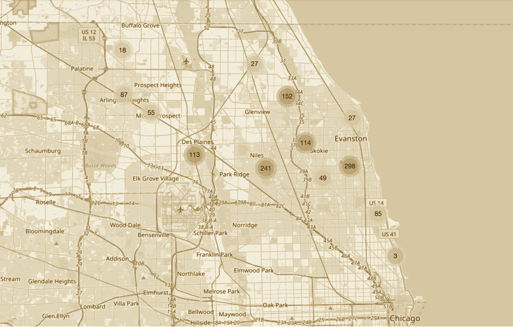
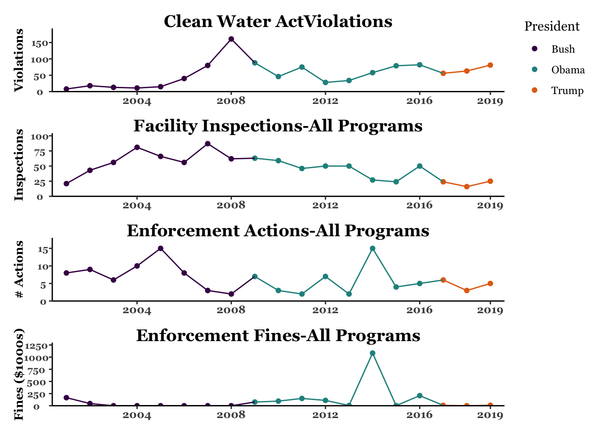
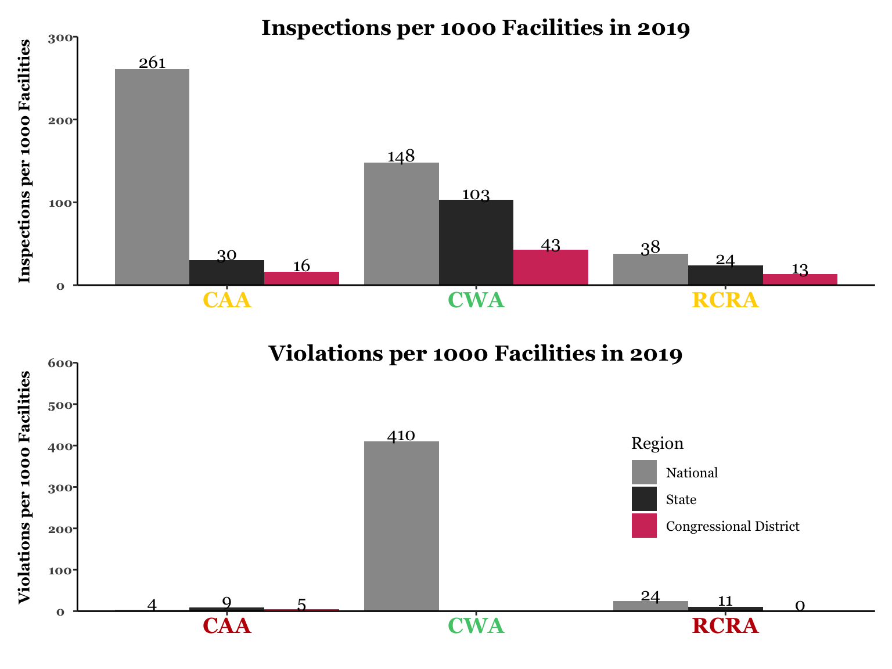
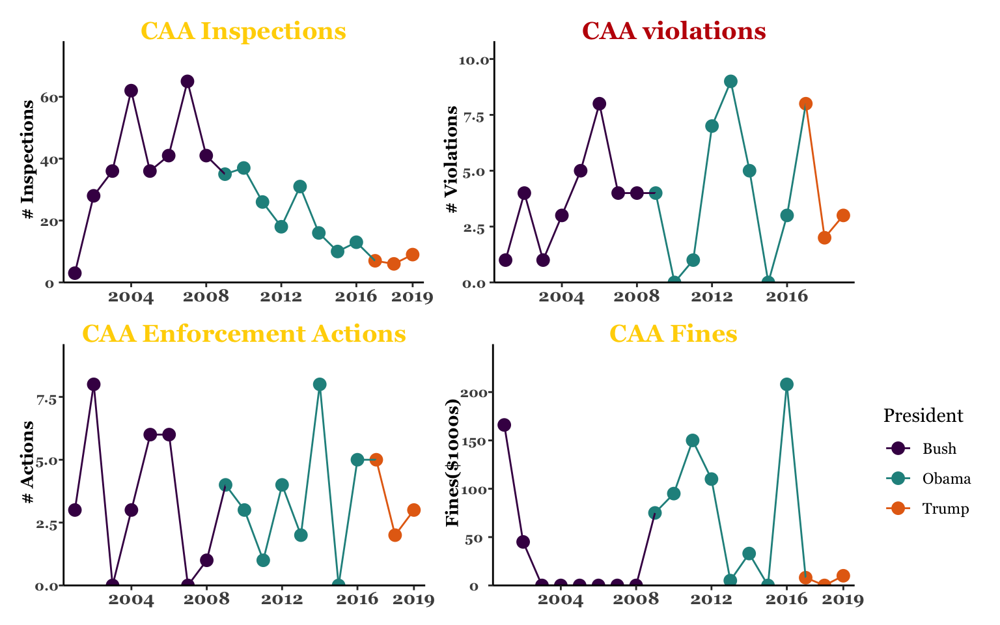
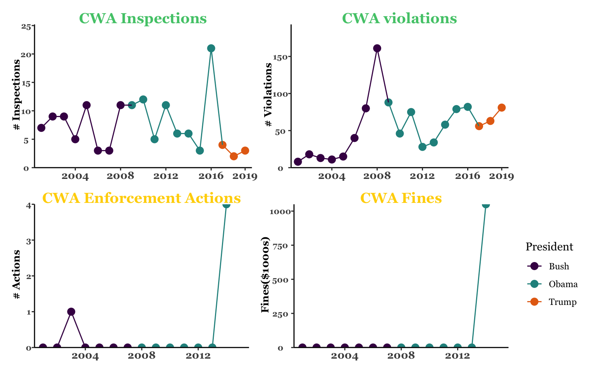

 

  
  
Illinois' 9th District

  
Seat held by Greg Walden since 1999

Map above shows congressional district with clusters of regulated facilities

### 2 September 2020
The [Environmental Enforcement Watch](https://www.environmentalenforcementwatch.org/) (EEW), a project of [EDGI](https://envirodatagov.org/), produced this report using data from the EPA. It provides information about pollution violations and the EPA’s efforts to control pollution. Congress has the power to strengthen and oversee how well EPA protects us from pollution. 

**Disclaimer:**
Data included herein were drawn from EPA's publicly available Enforcement and Compliance History Online ECHO database on August 25, 2020. EDGI has no control over the nature, content, or sustained availability of this database. While EDGI works to assure that the information in this report is correct, that information is subject to limitations of the ECHO database, and is provided “as is.” EDGI makes no representations or warranties of aOR kind, express or implied, about the completeness or reliability of this information. The information and images within this report are for general information purposes only. To examine this data for yourself you can view our analysis here and re-run it here.

\pagebreak

##### DRAFT not for circulation

# Why and What 

## Why
It is Congress's job to oversee how the laws it passes are implemented by agencies like the Environmental Protection Agency (EPA). Congress has charged the EPA with enforcing most of the laws that protect environmental health by controlling the release of pollution and hazardous materials into the air, water and land. Without effective enforcement, **these laws are meaningless**. Congress can strengthen EPA enforcement by increasing resources to the EPA, passing more effective laws, requiring better data collection, and general oversight. In the **House of Representatives**, the **Energy and Commerce Committee** is the main committee that oversees the EPA.  In the **Senate**, the **Environment and Public Works Committee** is the main committee that oversees the EPA. 

## What - the Data in this report 
While ECHO remains the only publicly available and comprehensive source for environmental compliance data, it is known to be extremely unreliable. According to former EPA Administrator Cynthia Giles, states often report less than 5% of violations under the regulations controlling clean air and hazardous waste, which means that ECHO data may exclude more than 95% of such violations. Therefore, other than the Clean Water Act, for which violations are reported through an automated system, violation data should not be considered accurate. It is important to note that states which might have the most violations may actually be the most responsible in terms of their reporting to EPA. Below is a color code of reliability for each data type presented in this report: 

<table>
 <thead>
  <tr>
   <th style="text-align:left;"> Metric </th>
   <th style="text-align:left;"> Color </th>
   <th style="text-align:left;"> Why </th>
  </tr>
 </thead>
<tbody>
  <tr>
   <td style="text-align:left;font-weight: bold;color: black !important;background-color: #50C878 !important;"> CWA Inspections and Violations; GHG Emissions </td>
   <td style="text-align:left;font-weight: bold;color: black !important;background-color: #50C878 !important;"> Green </td>
   <td style="text-align:left;font-weight: bold;color: black !important;background-color: #50C878 !important;"> Automatic monitoring and Reporting </td>
  </tr>
  <tr>
   <td style="text-align:left;font-weight: bold;color: black !important;background-color: #FFD300 !important;"> CAA Inspections,
                                    RCRA Inspections; CAA, CWA and RCRA Enforcement Actions and
                                    Penalities </td>
   <td style="text-align:left;font-weight: bold;color: black !important;background-color: #FFD300 !important;"> Yellow </td>
   <td style="text-align:left;font-weight: bold;color: black !important;background-color: #FFD300 !important;"> Problems of pass through of data from state to EPA </td>
  </tr>
  <tr>
   <td style="text-align:left;font-weight: bold;color: black !important;background-color: #C21807 !important;"> CAA Violations, RCRA violations </td>
   <td style="text-align:left;font-weight: bold;color: black !important;background-color: #C21807 !important;"> Red </td>
   <td style="text-align:left;font-weight: bold;color: black !important;background-color: #C21807 !important;"> Problems of self-reporting and pass through of data from state to EPA </td>
  </tr>
</tbody>
</table>
### See part 2 of [this report](http://eelp.law.harvard.edu/wp-content/uploads/Cynthia-Giles-Part-2-FINAL.pdf) for more information about lack of reporting 
\pagebreak

##### DRAFT not for circulation

# Highlights for Illinois' 9th District
* <h2>Highlight from Open Hour</h2>
* <h2>Highlight from Open Hour</h2>
* <h2>Highlight from Open Hour</h2>

<h2>Under the Clean Water Act, the most well-reported regulation, 14 facilities, representing 13.08% of all regulated facilities in IL9, were in violation for at least 25% of the last 3 years.</h2>

\pagebreak

##### DRAFT not for circulation

# Your District in Comparison

### See color-coded table on page 1 for data reliability color codes, visualized here as x-axis labels and on subsequent pages as chart titles
### Still need - 
* Enforcement fines nationally and statewide 

\pagebreak

##### DRAFT not for circulation 

# Clean Air Act

The Clean Air Act (CAA) is the comprehensive federal law that regulates air emissions from stationary and mobile sources. Among other things, this law authorizes EPA to establish National Ambient Air Quality Standards (NAAQS) to protect public health and to regulate emissions of hazardous air pollutants [EPA](https://www.epa.gov/laws-regulations/summary-clean-air-act). For the CAA, inspections are the most common way of identifying violations, so less violations aren't necessarily an improvement. Recent cuts in inspections is likely related to a drop in violations.
[More info on CAA](https://docs.google.com/presentation/d/1MzRQf3QeJqmYMSttdk0ghrXeOmOZgOV_MTynl-ri6Ik/edit?usp=sharing)

<h2>There are 874 
CAA facilities</h2>

\pagebreak

##### DRAFT not for circulation 

# Clean Water Act 

The Clean Water Act is a series of regulations that govern discharges of pollutants and regulates water quality standards for waters of the United States. The CWA established the National Pollutant Discharge Elimination System (NPDES) which permits discharges of pollutants [EPA](https://www.epa.gov/laws-regulations/summary-clean-water-act). Unlike the CAA, CWA violations are reported automatically through the National Pollutant Discharge Elimination System (NPDES), so violations are recorded independently of facility inspections. CWA inspections often occur in response to recorded violations.
[More info on CWA](https://docs.google.com/presentation/d/1g6ZN3B5jvs3F1VAigiUtNNezjXdJnzuELfo9Deo9Y2w/edit?usp=sharing)

<h2>There are 107 
CWA facilities</h2>

\pagebreak

##### DRAFT not for circulation

# Resource Conservation and Recovery Act 

The Resource Conservation and Recovery Act (RCRA) gives EPA the authority to 
control hazardous waste from the "cradle-to-grave", regulating the generation, transportation, treatment, storage, and disposal of hazardous waste. Although facilities self-report under RCRA, like the CAA, violations are most often found after an inspection, and a reduction in violations might mean a reduction in inspections. [EPA](https://www.epa.gov/laws-regulations/summary-resource-conservation-and-recovery-act) [More info on RCRA](https://docs.google.com/presentation/d/1lV9b_vkcfCbTz8uss1XjXLHy2svpi2tmizb6et1Wfkc/edit?usp=sharing)

<h2>There are 1767 
RCRA facilities</h2>

\pagebreak

##### DRAFT not for circulation

# Legislator Information   

## Greg Walden 

<h2>Republican</h2>
## In office since January 6th, 1999

## Relevant Committee Membership: Ranking Member, [Energy and Commerce Committee](https://energycommerce.house.gov/)
 
 

### [House Energy and Commerce Committee](https://energycommerce.house.gov/about-ec)
This Committee is the oldest house Committee with the broadest jurisdiction of aOR authorizing committee. The Committee oversees the EPA, and legislates on issues like environmental protection, clean air, climate change, safe drinking water, toxic chemicals and hazardous waste, and nuclear facilities. Currently, the Committee includes 55 members – 24 Republicans and 31 Democrats. The subcommittees of primary interest to these reports are Environment & Climate Change and Oversight & Investigations. 

### Relevant Subcommittees: 
1. Energy
2. Environment and Climate Change
3. [Oversights and Investigations](https://energycommerce.house.gov/subcommittees/oversight-and-investigations-116th-congress)
4. Health

\pagebreak

##### DRAFT not for circulation  

# Data Limitations   

<h3>Disclaimer</h3>

On March 26, 2020, the US EPA released [a policy memo](https://www.epa.gov/sites/production/files/2020-03/documents/oecamemooncovid19implications.pdf) suspending pollution monitoring requirements for industries that claim to have been impacted by COVID-19. Since then, as part of EDGI’s ongoing Environmental Enforcement Watch (EEW) project, we have conducted original data science research using EPA’s Enforcement and Compliance History Online ECHO database to investigate the effects of this policy on facility reporting of environmental data and compliance with environmental protection laws. Results show that, despite relatively few facilities claiming the COVID exemption, a much larger proportion of facilities are still failing to report. While both industry non-compliance and EPA non-enforcement reflect longer-term trends (as much as 70% of facilities were already in non-compliance with the nation’s environmental laws for certain regulatory programs pre-COVID, [Giles 2020](http://eelp.law.harvard.edu/wp-content/uploads/Cynthia-Giles-Part-2-FINAL.pdf)), we have decided to exclude 2020 data from this analysis due to EPA’s COVID-19 policy. This decision serves to provide the fairest and most accurate picture of enforcement and compliance trends, and to avoid skewing and misrepresenting the data.
.

The ECHO database compiles information from a number of distinct state and federal databases with inconsistent reporting schemes that lead to data gaps and inaccuracies such as geocoding errors (e.g. a facility in Texas is incorrectly coded as residing in Louisiana); multiple program IDs attributed to a single facility (which can cause one facility to appear as multiple, distinct facilities in the data); and an inability to know what/how maOR facilities operated in the past. EPA acknowledges some of these inconsistencies, and sometimes includes disclaimers on the ECHO website detailing them. The agency’s official position is that ECHO data is reliable-enough from 2001 onward, but former EPA Administrator Cynthia Giles says that states often report as little as 5% of compliance violations to ECHO for certain regulatory programs. 
Here are just some of the issues that prevent citizens from knowing how well pollution has been, and is, being controlled: 

* Some facilities chronically or repeatedly fail to comply with pollution laws. But available EPA data only goes back X years, so you cannot tell how well facilities in your area have complied with environmental protections over time. 
* No idea how maOR facilities operated in the past
* Multiple program IDs for a single facility/permit
* Geocoding errors
* Mislabeled times (e.g. the inspections that will occur in 2052)
* Data entry errors that place inspections and enforcements in the wrong year (some in the future!) and that place facilities in the wrong state or area.

\pagebreak

##### DRAFT not for circulation

# About the Authors

### About EEW and this Project

Environmental Enforcement Watch (EEW) is a collaborative project across EDGI working groups. The EEW project builds on EDGI’s 2019 [Sheep in the Closet Report](https://envirodatagov.org/publication/a-sheep-in-the-closet-the-erosion-of-enforcement-at-the-epa/) that documents large declines in EPA enforcement of environmental laws. This project and others used data from EPA’s [ECHO](https://echo.epa.gov/) database, revealing how useful ECHO could be for communities to track pollution and EPA responses in their areas. However, they also revealed the inaccessibility of ECHO for non-specialists, along with maOR omissions, errors, and confusions present in the data itself.

A key goal of EEW is to highlight gaps and inadequacies in the enforcement of environmental laws, demonstrating EPA’s failure to fulfill its congressionally mandated duty. To help bring awareness and action to the state of environmental non-compliance across the US, we are using Jupyter Notebooks that utilize ECHO data to present these congressional report cards for the 75 Senators and House Representatives that sit on the House Energy & Commerce Committee and the Senate Environment & Public Works Committee. By providing a novel and poignant look at the chronic state of non-compliance in their states and districts, we hope to provide these key representatives with the information and pressure they need to hold the EPA accountable. 

<h3>About EDGI</h3>

EDGI is an international network of over 175 members from more than 80 different academic institutions and non-profits, comprised foremost by grassroots volunteer efforts. Since 2016, EDGI has served as a preeminent watchdog group for federal environmental data, generating international effort to duplicate and monitor repositories of public data that are vital to environmental health research and knowledge.
EDGI’s work has been widely acknowledged, leading to EDGI testifying before Congress on declines in EPA enforcement, and hundreds of mentions in leading national and international media such as _The New York Times_,_The Washington Post_, Vice News, and CNN. For more about our work, read our [2019 Annual Report](https://envirodatagov.org/publication/edgi-annual-report-2019/)and [2020 Annual Report](https://envirodatagov.org/publication/edgi-annual-report-2020/).

#### [Contact Us](https://www.environmentalenforcementwatch.org/contact/)

