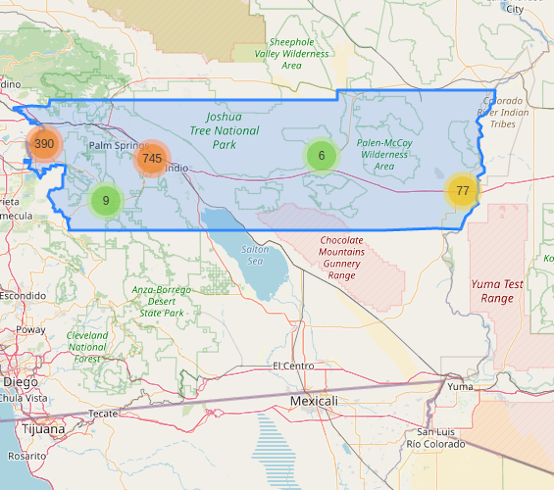

# CD-report
This is the repository where we store the data and code used to generate EEW's congressional report cards. For more on the project and resulting report cards See the EEW website: https://www.environmentalenforcementwatch.org/

## Making CD Reports

1. Clone this repository or get the zip file on your computer. 
2. Extract the CD_Dirs.zip and State_Dirs.zip.  These have all of the data from the AllPrograms Jupyter notebook for the districts we will be making report cards for.  The data for each CD is in a separate directory which, when unzipped, should be directly inside the CD-reports directory.  
3. Downlaod the "national stats" folder
4. Download the "logosandimages" folder. 
5. Download the Rmd template you will be using to construct the final report.
    THE CURRENT RMD TO COPY FROM IS "VA4_2020.Rmd" for Congressional Districts
    THe CURRENT RMD TO COPY FROM IS "WY_2020.Rmd" for States 
6. Download the file custom_current.css from the "reportcards" folder in this branch. 
7. Create a local folder called "reportcards" that contains the copy of the most recent .rmd and teh custom_current.css.


## Notes on Naming and Special Districts (irrelevant info for someone making a report on their own, only for EDGI team)

We've decided our urls will be "/XXN-2020" with XX being the state code and N being the district number. Example: VA4_2020. Let's name the .rmds accordingly so we can very quickly make the links live.

For districts that do not have a # because they are small (i.e Deleware, we are going to name the file DE00_2020 so we can differentiate from the senator report card which would be DE_2020. 

### Special Districts 

AK, IA2, MI7, NY9 and WA5 are outliers on the "grade" dot plot, and therefore the dotplot code will not work for these 5 districts. In case you want to run one of this geographies, here's what you need to do:
1. locate the folder "outlierdotplots" in the master branch and download it.
2. move the correct dot plot into your local file folder for the district you're working on
3.  block out or delete code lines 189-208 in the .rmd - in case the line #s change slightly, this code looks like this: 
```
dotplot <-ggplot(CWAper100, aes(x=Region, y=Per100, fill=Highlight))+
  geom_dotplot(binaxis='y', stackdir='centerwhole', stackratio=2.5, binwidth=15,
               dotsize=2)+
  geom_hline(yintercept=100, linetype="dashed", color="#e56d13")+
  geom_hline(yintercept=0, linetype="dashed", color="#569b5e")+
  scale_fill_manual(values=c("#ffffff","#e56d13"))+
  labs(title="CWA Violations per 100 Facilities in 2019", x="CD/State", y="")+
  geom_text(aes(label="100 violations per\n100 facilities*", family="Georgia"),
            x=2.35, y=180, color="#e56d13", size=3)+
  geom_text(aes(label="0 violations", family="Georgia"),
            x=2.4, y=15, color="#569b5e", size=3)+
  annotate("text", label="Outliers:\nNY9-2650 violations\nWA5-1029 violations\nMI7-865 violations\nAK-841 violations\nIA2-826 violations",
             x=2.3, y=600, color="black", size=3, family="Georgia")+
  theme_meg()+
  theme(axis.line.x=element_blank(), axis.title.x=element_blank(),
        legend.title = element_blank(), axis.text.x=element_text(size=10), legend.position = c(0.1,.8))

ggsave("dotplot_VA4.png", dotplot, path=here("CD_Dirs/VA4"), scale = 2, width=8, height=5, units=c("cm"))
```

## Keeping Track of what districts we've run (irrelevant info for someone making a report on their own, only for EDGI team)

Let's use [this spreadsheet](https://docs.google.com/spreadsheets/d/1dXJLIVnqKmhn95RRCgp7yw_a5UPGPgW4PyT264QTeTQ/edit?usp=sharing)

The first column of both sheets in this spreadsheet is titled "Report Card Completed". Let's color the cell yellow if the html is complete and in the reportcards folder green if the html is complete and I've made it live and blank if it has not been completed.

Additional 2 columns to fill out: 
1. Dotplot check? 
    Mark this column red if the dotplot has inverted colors (all dots orange) OR the correct dot is not displayed
2. Map check? 
    Mark this column red if the EEW and EDGI logos do not appear on the first page

## Recommended working directory structure

```
CD-reports
    |
    |- CD_maps
    |    |
    |    |- AZ1_map.png
    |    |- CA22_map.png
    |    |- ...
    |
    |- CD_images
    |    |
    |    |- ...
    |    |- CA36_rep.png
    |    |- CA44_rep.png
    |    |- ...
    |    |- DE_sen.png
    |    |- ...
    | 
    |- CD_Dirs
    |    |- AZ1
    |    |    |
    |    |    |- active-facilities_All_pg3_AZ-1-091820.csv
    |    |    |- ...
    |    |
    |    |- CA6
    |    |    |
    |    |    |- active-facilities_All_pg3_CA-6-091820.csvinspectionsper
    |    |    |- ...
    |    |    |
    |
    |- ...
    |
    |- nationalstats
    |    |
    |    |- USA....csvinspectionsper
    |    |- ...
    |
    |- logosandimages
    |    |
    |    |- facilities2.png
    |    |- ...
    |
    |- reportcards
         |
         |- eew_template_VA4.Rmd
         |- eew_template_VA4.html
         |- eew_template_VA4.pdf
         |- ...
``` 

## Make a map PNG file of the right size

### All maps should be done for the 76 House E&C and Senator EPW

The HTML maps in CD_76_maps_html.zip are dynamic--they can be zoomed in or out to get the best view of the district.  We need to use a screen shot tool to snip out a static image, then use a photo or image editor to make our image the right size for the report cards.
We'll aim to make an image of the CD that is 490 pixels tall and 550 pixels wide.  We'll try to get them as close to those dimensions as possible, but being off by 1-5 pixels won't be noticable.
1. Open a map HTML file in a browser.  Zoom in and out to get the district to show as clearly as possible.
2. Use a screen snipping tool to snip a rectangle of approximately the right shape, but with a little extra on all sides.  Try to center the district in your rectangle.  Since we want width/height to end up 550/490, make your rectangle a little wider than it is tall, no matter what shape the district may be.
3. Open the screenshot image in your image editor.  I like the open source GNU Image Manipulation Program (GIMP). We'll use the image editor to size the image to the 550/490 preferred dimensions.
4. We need to figure out if we need to crop some off the top and bottom or off the sides.  
    a.  First, try setting the width to 550, let the image editor adjust the height to maintain proportions. If that makes the height adjust to less than 480, set the height to 480 and let it adjust the width to a number that will be larger than our preferred 550. Accept that, and we'll move on to cropping the sides.
    b.  If setting the width to 550 and letting the editor adjust the height results in a height greater than 490, accept that scaling and we'll move on to cropping the top and bottom.
5. We should now have an image in our editor that is correct for either height or width, and too large in the other dimension.  Hopefully there is enough border around our district in the scaled image that we can crop away enough from the edges that are too large to get to our desired shape.  
    a.  Make note of how much too large it is.  Depending on how you snipped from the original HTML you might want to take all of the excess of one side, or you might want to split it and take half off each side.
    b.  The image editor may have a pixel ruler on the sides that can help you see how much you are cropping.  Use a rectangle select tool to select the region you want to keep.  Remember that you already have one dimension just how you want it, so you should include all of that dimension.
5. When you have the image as close as you can get it to 550x490, export it as a PNG file with the name XXN_map.png, where XX is the state abbreviation, and N is the district number, like AZ1_map.png.
    a.  Save your XXN_map.png locally, perhaps in a a folder called CD_maps that is parallel to where you unpacked CD_Dirs.zip.  (We can't put them into the CD directory with the data, because all the data is stored in github in this one zip file, so we will each have our own copy of that data.)
    b.  Upload your XXN_map.png to the CD_maps directory in the CD-reports github repository, zipfile-csvs branch.
       

## Making a report card

If you are running this from the CD-reports folder, the paths to the files should be like those shown below.
  
1. In the reportcards folder make a copy of the most recent eew_template.Rmd.  Name the new file eew_template_XXN.Rmd, where XX is the state abbreviation and N is the district number.
2. In RStudion use File->File Open to open the new .Rmd file.
3.a FOR CONGRESSIONAL DISTRICTS: Use Command-F (Mac) or Ctrl-F (Windows/Linux) to make these changes.  Use your own state and district in place of California's 36th district in these examples..  **Run these replacements in this exact order.**
```
    a. Virginia's 4th --> California's 36th  (expect 2 replacements)
    b. VA 4 --> CA 36  (expect 9 replacements)
    c. _VA-4 --> _CA-36  (expect 26 replacements)
    d. VA4 --> CA36 (expect 42 replacements)
    e. _VA- --> _CA- (expect 6 replacements)
    
``` 

3.b FOR STATES: Use Command-F (Mac) or Ctrl-F (Windows/Linux) to make these changes.  Use your own state in place of Mississippi in these examples.  **Run these replacements in this exact order.**

``` 
a. Wyoming --> Mississippi
b. WY --> MS 


4. Use the find function (but without any replacement) to look for this string:  'inspectionsper1000_All_pg4', then see what date stamp follows.  The date stamp for all of our data is 091820.  If the date you find is other than that (e.g. 090820), do another global find/replace:
``` 090820  -->  091820  (expect 6 replacements) ```

```
    a. If your directory is set up as above, the link to the image should look like:
        <a ></a>
    b. A few lines down, edit to get the correct committees and sub-committees.
```
5. Check image locations.  (Use the find function to look for 'png'.)  The logos appear twice, so check both of them.
``` There should be facilities2.png, eew_logo.png and edgi_logo.png images in the reportcards folder where you are running this from, 
    so the links should look like this:
      <a href="https://www.environmentalenforcementwatch.org/"></a>

      <a href="https://envirodatagov.org/"></a>
    The link to the map file should look like this:
      
    The legislator's image should be in the CD_76_images directory, so the link will be like:
      <a ></a>

```
6. In the RStudio Session menu, Set Working Directory to the reportcards directory.
7. In the Console area of RStudio, enter ```library(pagedown)``` and hit Enter.
8. In the Console area of RStudio, enter this command and hit Enter, changing it to your state and district:
``` pagedown::chrome_print( "WV1_2020.Rmd" ) ```
    
9. If the dotplot colors reverse so that all are red and the current district white, make this change and re-run: Go to line 199 ( where the dotplot creating code is) and change this: ```scale_fill_manual(values=c("#FFFFFF","#E56D13"))+ ``` to this: ```scale_fill_manual(values=c("#E56D13", "#FFFFFF"))+```
10. If there is only one bad actor and the horizontal bar graph just has one black box, make this change and re-run:
```
CAAfacilities <- CAAbadactors %>%
  mutate(Facility = fct_reorder(Facility, noncomp_count)) %>%
  ggplot(aes(x=Facility, y=noncomp_count))+
  geom_col(width = 0.1)+
  scale_fill_viridis(discrete = TRUE, option="B")+
  labs(y="Quarters in Violation", x="", title="CAA Violators")+
  scale_y_continuous(expand=c(0,0))+
  # scale_x_discrete(expand=c(0,0))+
 theme_meg()+
  theme(axis.text.y=element_text(size=12, face = "bold", color="black"), axis.title.x = element_text(size=14), axis.text.x=
          element_text(size=14,face = "bold"), plot.title=element_text(size=16))+
  coord_flip()
```
For CAA this is at line 514, for CWA it is line 538, and for RCRA it is at 564.
