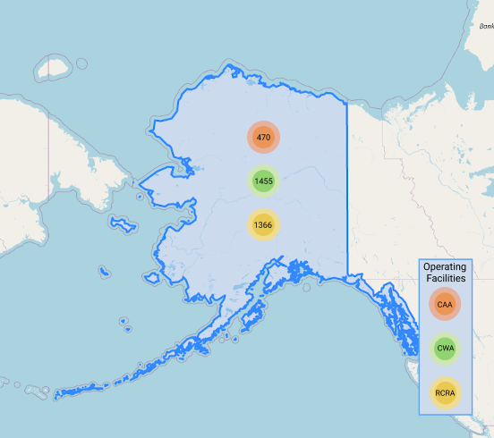
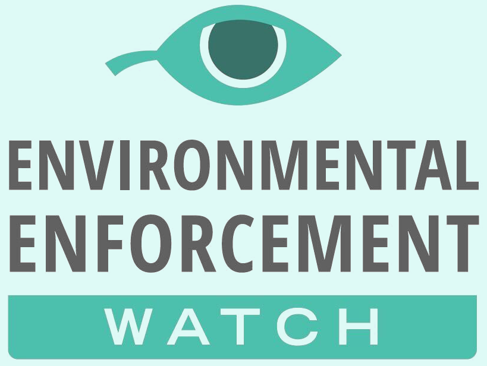

```{r setup, include=FALSE}
library(tidyverse)
library(palmerpenguins)
library(patchwork)
library(here)
library(ggplot2)
library(tidyr)
library(dplyr)
library(shiny)
library(extrafont)
library(viridis)
library(grid)
library(gridExtra)
library(fishualize)
library(kableExtra)
library(ggrepel)
library(stringr)
loadfonts()


knitr::opts_chunk$set(echo = FALSE, message = FALSE, warning = FALSE)
```

```{r readData, echo=FALSE}

#reading in all of the data and naming it based on the name of the .csv up to the first 2 underscores
#national data
filenames = list.files(here("../nationalstats"), pattern = ".csv")
file_count = length(filenames)
for (i in filenames){  
  name <- gsub("^([^_]*_[^_]*)_.*$","\\1", i)
  assign(name, read.csv(here("../nationalstats", i)))
}

names(USAinspectionsper1000_All)[1] <- "Program"
names(USAviolationsper1000_All)[1] <- "Program"
inflation <- inflation.csv
names(inflation)[2] <- "base"
senators <- senatorinfo.csv
CWAper1000 <- violationsper1000_CWA

#each time this section is run, change "here" to specify the subfolder for the district or state 
#Also, the way it is set up, you're going to need to cntrl f to change the district and date for the files
filenames = list.files(here("../CD_Dirs/AK"), pattern = ".csv")
file_count = length(filenames)
for (i in filenames){  
  # name <- gsub("^([^_]*_[^_]*_[^_]*_[^-]*-[^-]*)-.*$","\\1", i)
  name <- gsub("^([^_]*_[^_]*_[^_]*_[^-]*)-.*$","\\1", i)
  assign(name, read.csv(here("../CD_Dirs/AK", i)))
}

activefacilities <- `active-facilities_All_pg3_AK`

#set up a theme default to reduce code block later 
theme_meg <- function () { 
  theme_bw(base_family="Georgia") %+replace% 
    theme(panel.grid.major = element_blank(), panel.grid.minor = element_blank(),panel.border = element_blank(),
          axis.line = element_line(colour = "black"), axis.title.x=element_text(face = "bold", size = 12), 
          axis.title.y=element_text(face = "bold", size = 8, angle=90), plot.title=element_text(face = "bold", size = 14, hjust =.5), 
          axis.text.x=element_text(face = "bold", size = 14), axis.text.y=element_text(face = "bold", size=8), plot.margin=unit(c(1,1,1,1),"cm"), plot.subtitle=element_text(face="bold",size=8))
}

common_caption <- "Estos valores han sido ajustados para tomar en cuenta \nla inflación, tenga en cuenta que el eje-y informa \nvalores en 1000’s. Un valor de $2,000 representa \n$2,000,000 (2 millones de dólares)."

AK <- senators[which(senators$state=="AK"), ]
```

  <div class="title"><span style="padding-left: 50px">
 Boleta de calificaciones a nivel Congresual
 </span></div>
 <hr style="height:3px;border-width:0; margin-left:15px; margin-right:15px;color: #b9b9b9;background-color: #b9b9b9; margin-top: 0em; margin-bottom: 0em">
##### El estado de Alaska; asiento ocupado por `r AK[1,2]` desde `r AK[1,8]` 
 <div class="container">
  
   <div class="bottom-left">El mapa demuestra el Distrito Congresual o Estado con grupos de instalaciones reguladas</div>
  </div>
<a href="https://www.environmentalenforcementwatch.org/"></a>
<a href="https://envirodatagov.org/"></a>

\pagebreak


<h4>INFORME GENERADO EL 12.13.2020<span style="padding-left:350px">PÁGINA 1</span></h4>


# INTRODUCCIÓN 

**IMPORTANTE: Debido a que algunos sitios web no están disponibles en español, algunos enlaces llegan a sitios de web en inglés, para poder leerlos en español, puede bajar la extensión de Google Chrome, “Google Translate” y utilizar la función “translate this page” o “traducir esta página”**

## ¿Por qué generar boletas de calificaciones sobre el cumplimiento y la aplicación de las leyes ambientales?

El Congreso encarga a la Agencia de Protección Ambiental (EPA) que aplique las leyes que protegen a las personas de la contaminación del aire, la contaminación del agua y los desechos peligrosos. Sin aplicación y cumplimiento efectivo, estas leyes son inservibles. Esta boleta de calificaciones está basada en datos de la base de datos del Historial de Cumplimiento y Aplicación en Línea (ECHO) de la EPA. La boleta de calificaciones revisa las violaciones, inspecciones y acciones de aplicación bajo tres leyes: Ley de Aire Limpio (CAA), Ley de Agua Limpia (CWA) y Ley de Conservación y Recuperación de Recursos (RCRA) para este estado desde 2001. Las boletas de calificaciones están disponibles en el sitio web de EEW para todos los miembros de los comités del Congreso que supervisan la EPA: el Comité de Energía y Comercio de la Cámara de Representantes y el Comité de Obras Públicas y Medio Ambiente del Senado. El sitio web de EEW también tiene un análisis de las tendencias de aplicación de leyes ambientales a nivel nacional e información sobre los problemas de datos. Las boletas de calificaciones contienen datos de las agencias ambientales estatales y también de la EPA. Siempre que los estados hagan cumplir las leyes anteriores, es porque la EPA les ha delegado esa autoridad. La EPA debe asegurarse de que los estados estén haciendo su trabajo. El Congreso debe asegurarse de que la EPA esté haciendo su trabajo. Y el público debe tener datos precisos de los estados y de la EPA para entender si las leyes ambientales nacionales se están aplicando correctamente. Por primera vez, las boletas de calificaciones a nivel Congresual de EEW brindan a los congresistas y a sus electores la oportunidad de evaluar si la EPA está cumpliendo con su mandato en su estado. El Congreso puede fortalecer la aplicación de la EPA aumentando su presupuesto, aprobando leyes más efectivas, requiriendo una mejor recopilación de datos y haciendo responsable a la EPA cuando no protege a las personas.

## ¿Qué es una “instalación regulada”?

<a ></a>

<br />

En este informe, una instalación regulada es una instalación que reporta las emisiones al aire o al agua según la Ley de Aire Limpio o la Ley de Agua Limpia, o una instalación que genera, transporta y elimina desechos peligrosos según la Ley de Conservación y Recuperación de Recursos. Las instalaciones reguladas pueden ser a gran escala, como las refinerías de petróleo, o a pequeña escala como las tintorerías.

### [Glosario](https://docs.google.com/document/d/1oUAOdci38_VeDbABznZvL9BlJPLuXmEmc-OhggEB4Jc/edit?usp=sharing)

\pagebreak

<hr style="height:3px;border-width:0;color: #C1E0D7;background-color: #C1E0D7; margin-top: 2em">
<h4>INFORME GENERADO EL 12.13.2020<span style="padding-left:350px">PÁGINA 2</span></h4>

# LOS CAMBIOS PRINCIPALES EN ESTE ESTADO BAJO LA ADMINISTRACIÓN DE TRUMP

```{r echo=FALSE}

##getting %difference CWA violations
CWAviolations <- `violations_CWA_pg6_AK`
names(CWAviolations)[2] <- "Count"
names(CWAviolations)[1] <- "YEAR" ## "Año"
CWAviolations <- CWAviolations[-c(20),]
CWAviolations$President <- as.character("Bush")
CWAviolations[9:16,3] <- as.character("Obama")
CWAviolations[17:19,3] <- as.character("Trump")

vCWAchange <- data.frame("El Promedio de Bush/Obama" =mean(CWAviolations[1:16,2]),
                             "El promedio de Trump" =mean(CWAviolations[17:19,2]))

vCWAchange$PercentDifference <- as.numeric(100*(vCWAchange[1,2]-vCWAchange[1,1])/
                                                 vCWAchange[1,1])
vCWAchange$PercentDifference <-round(vCWAchange$PercentDifference,0)

vCWAchange$Extra <- ifelse((vCWAchange$PercentDifference>=100)|(vCWAchange$PercentDifference<=-100), "mucho", "")
vCWAchange$Change <- ifelse(vCWAchange$PercentDifference<0, "mejor", "peor")

vCWAchange$Positive <- abs(vCWAchange$PercentDifference)
vCWAchange$Value <- ifelse(vCWAchange$PercentDifference>=0, "aumento", "disminución")

#enforcement % difference
enforcement <- `enforcements_All_pg3_AK`
names(enforcement)[1] <- "Date"
enforcement <- enforcement[-c(20),]
enforcement$Amount <- round(enforcement$Amount,2)
#add presidental years
enforcement$President <- as.character("Bush")
enforcement[9:16,4] <- as.character("Obama")
enforcement[17:19,4] <- as.character("Trump")

actionchange <- data.frame("BushObamaAverage" =mean(enforcement[1:16,3]),
                             "Trump Average" =mean(enforcement[17:19,3]))

actionchange$PercentDifference <- as.numeric(100*(actionchange[1,2]-actionchange[1,1])/
                                                 actionchange[1,1])

actionchange$PercentDifference <-round(actionchange$PercentDifference,0)

actionchange$Extra <- ifelse((actionchange$PercentDifference>=100)|(actionchange$PercentDifference<=-100), "much", "")
actionchange$Change <- ifelse(actionchange$PercentDifference<0, "mejor", "peor")

actionchange$Positive <- abs(actionchange$PercentDifference)
actionchange$Value <- ifelse(actionchange$PercentDifference>=0, "aumento", "disminución")

```

<h3>Violaciones de la Ley de Agua Limpia *: son <span style="color:#569b5e">`r vCWAchange[1,4]` `r vCWAchange[1,5]`</span> que el promedio de los 16 años anteriores, lo que representa un aumento del  <span style="color:#569b5e">`r vCWAchange[1,6]`% `r vCWAchange[1,7]`</span> en violaciones</h3>

<br />

<h3>Acciones de aplicación bajo la Ley de Aire Limpio, la Ley de Agua Limpia y la Ley de Conservación y Recuperación de Recursos*: <span style="color:#569b5e">`r actionchange[1,4]` `r actionchange[1,5]`</span> que el promedio durante los 16 años anteriores, lo que representa <span style="color:#569b5e">`r actionchange[1,6]`% `r actionchange[1,7]`</span> en las acciones de aplicación</h3>

*consulte la página de limitaciones de datos para los cálculos métricos

<br />

```{r, fig.height = 7, fig.width = 5, fig.align = "left"}

CWAper1000$Num.per.1000 <- as.numeric(round(CWAper1000$Num.per.1000,0))
CWAper1000$Highlight <- ifelse(CWAper1000$CD.State=="AK", "AK", "otros CDs/\nestados")
CWAper1000$Per100 <- as.numeric(CWAper1000$Num.per.1000/10)


#make a dataframe that is per 100

CWAper100 <- CWAper1000
#removing NY9 and WA5 and MI7, AK, and IA2 and extra CA9
CWAper100 <- CWAper100[-c(37,51,28,14,53,8),]

AK_dot <- CWAper1000[which(CWAper1000$CD.State=="AK"), ]

##THIS CODE WILL NOT WORK FOR NY9 and WA5 and MI7, AK, and IA2. Omit this chunk of code for those districts (here to the end of this r chunk)

dotplot <-ggplot(CWAper100, aes(x=Region, y=Per100, fill=Highlight))+
  geom_dotplot(binaxis='y', stackdir='center', stackratio=1.5, binwidth=15,
               dotsize=1.5, position=position_dodge(.4))+
  geom_hline(yintercept=100, linetype="dashed", color="#e56d13")+
  geom_hline(yintercept=0, linetype="dashed", color="#569b5e")+
  scale_fill_manual(values=c("#ffffff","#e56d13"))+
  labs(title="Violaciones de la ley de Agua Limpia\npor cada 100 instalaciones en 2019", x="CD/State", y="")+
  geom_text(aes(label="100 violaciones por\ncada 100 instalaciones*", family="Georgia"),
            x=2.35, y=130, color="#e56d13", size=2.3)+
  geom_text(aes(label="0 violaciones", family="Georgia"),
            x=2.4, y=15, color="#569b5e", size=2.3)+
  annotate("text", label="Valores atípicos (no mostrados):\nNY9-2650 violaciones\nWA5-1029 violaciones\nMI7-865 violaciones\nAK-841 violaciones\nIA2-826 violaciones",
             x=2.3, y=500, color="black", size=2.3, family="Georgia")+
  theme_meg()+
  theme(axis.line.x=element_blank(), axis.title.x=element_blank(),
        legend.title = element_blank(), axis.text.x=element_text(size=10, hjust=.6), legend.position = c(0.15,.8), axis.ticks.x=element_blank())+scale_x_discrete(labels=c("Distritos Congruesales del\nComité de Energía y Comercio","Estados del Comité de Obras\nPúblicas y Medio Ambiente"))
ggsave("dotplot_AK.png", dotplot, path=here("../CD_Dirs/AK"), scale = 2, width=9, height=5, units=c("cm"))

```
 
<a ></a>

*Este es un promedio, no significa que todas las instalaciones tengan una violación. Algunas instalaciones pueden tener muchas más violaciones o cero violaciones.
<br />
<br />

<h3>En AK, hubo <span style="color:#569b5e">`r AK_dot[1,5]`</span> violaciones de la Ley de Agua Limpia por cada 100 instalaciones reguladas en 2019.</h3>

\pagebreak

<hr style="height:3px;border-width:0;color: #C1E0D7;background-color: #C1E0D7; margin-top: 2em">
<h4>INFORME GENERADO EL 12.13.2020<span style="padding-left:350px">PÁGINA 3</span></h4>
```{r echo=FALSE}
#CAA

##first let's fix up the data
#ok so We'll put the % in the title for the state, and try to figure out the same for AK
CAArecurring <- `recurring-violations_All_pg3_AK`[-c(2,3,5,6),]
CAArecurring <- CAArecurring %>%
  select(State,Facilities, Percent)
names(CAArecurring)[1] <- "Region"
CAArecurring[1,1] <- as.character("Rest of State")
CAArecurring[2,1] <- as.character("AK")
CAArecurring$Region2 <- as.character("All of OR")
CAArecurring[2,4] <- as.character("AK")
CAArecurring$RecurringViolators <- (as.numeric(CAArecurring[1,2]-CAArecurring[2,2]))
CAArecurring[2,5] <- as.numeric(CAArecurring[2,2])
CAArecurring$Proportional <- (as.numeric((100/(CAArecurring[1,2]))*CAArecurring[1,5]))
CAArecurring[2,6] <- as.numeric(100-CAArecurring[1,6])
CAArecurring[3] <-round(CAArecurring[3],2)

#CWA

##first let's fix up the data
#ok so We'll put the % in the title for the state, and try to figure out the same for AK
CWArecurring <- `recurring-violations_All_pg3_AK`[-c(1,3),]
CWArecurring <- CWArecurring %>%
  select(State,Facilities, Percent)
names(CWArecurring)[1] <- "Region"
CWArecurring[3] <-round(CWArecurring[3],0)

#RCRA

##first let's fix up the data
#ok so We'll put the % in the title for the state, and try to figure out the same for AK
RCRArecurring <- `recurring-violations_All_pg3_AK`[-c(1,2,4,5),]
RCRArecurring <- RCRArecurring %>%
  select(State,Facilities, Percent)
names(RCRArecurring)[1] <- "Region"
RCRArecurring[1,1] <- as.character("Rest of State")
RCRArecurring[2,1] <- as.character("AK")
RCRArecurring$Region2 <- as.character("All of OR")
RCRArecurring[2,4] <- as.character("AK")
RCRArecurring$RecurringViolators <- (as.numeric(RCRArecurring[1,2]-RCRArecurring[2,2]))
RCRArecurring[2,5] <- as.numeric(RCRArecurring[2,2])
RCRArecurring$Proportional <- (as.numeric((100/(RCRArecurring[1,2]))*RCRArecurring[1,5]))
RCRArecurring[2,6] <- as.numeric(100-RCRArecurring[1,6])
RCRArecurring[3] <-round(RCRArecurring[3],2)
```

```{r echo=FALSE}
##getting %difference effluent violations

##So, we're going to do the first 3 years of Obama and Trump so average
#[9:11,2] Obama
# [17:19,2] Trump
effluentviolations <- `violations_CWA_pg3_AK`
effluentviolations <- effluentviolations[-c(20),]
effluentchange <- data.frame("El promedio de Obama" =mean(effluentviolations[9:11,2]),
                             "El promedio de Trump" =mean(effluentviolations[17:19,2]))
effluentchange$PercentDifference <- as.numeric(100*(effluentchange[1,2]-effluentchange[1,1])/
                                                 effluentchange[1,1])
effluentchange[,1:3] <-round(effluentchange[,1:3],2)

#then simple plot
#first add in the Presidential Years
effluentviolations$President <- as.character("Bush")
effluentviolations[9:16,3] <- as.character("Obama")
effluentviolations[17:19,3] <- as.character("Trump")

effluentgraph <- ggplot(effluentviolations, mapping=aes(x=factor(Year),
  y=Violations, fill=President, group=1))+
  geom_bar(stat="identity")+
  scale_fill_manual(values=c("#450d54", "#22908d", "#e56d13"))+
  labs(y=" # de Violaciones", x="Año", title="Violaciones de la Ley de Agua Limpia\n", subtitle ="Datos mayormente completos")+
  scale_y_continuous(expand=c(0,0), limits=c(0,max(effluentviolations$Violations+(.2*max(effluentviolations$Violations)))))+
  scale_x_discrete(breaks=c(2004,2008,2012,2016,2019))+
  theme_meg()+
  theme(axis.text.x=element_text(size=9),
        axis.title.x = element_blank(), plot.subtitle = element_text(hjust=.5, size=9), plot.title = 
          element_text(lineheight = .1, size=10))

##Inspections % change and graph

##So, we're going to do the first 3 years of Obama and Trump so average
#[9:11,2] Obama
# [17:19,2] Trump
inspections <- `inspections_All_pg3_AK`
names(inspections)[1] <- "Date"
inspections <- inspections[-c(20),]
inspectionchange <- data.frame("El promedio de Obama" =mean(inspections[9:11,2]),
                             "El promedio de Trump" =mean(inspections[17:19,2]))
inspectionchange$PercentDifference <- as.numeric(100*(inspectionchange[1,2]-inspectionchange[1,1])/
                                                 inspectionchange[1,1])
inspectionchange[,1:3] <-round(inspectionchange[,1:3],0)

#syntax for bullet points
inspectionchange$Change <- ifelse(inspectionchange$PercentDifference>=0, "aumento", "disminución")
inspectionchange$Positive <- abs(inspectionchange$PercentDifference)

#then simple plot
#first add in the Presidential Years
inspections$President <- as.character("Bush")
inspections[9:16,3] <- as.character("Obama")
inspections[17:19,3] <- as.character("Trump")

inspectiongraph <- ggplot(inspections, mapping=aes(x=factor(Date),
                                                        y=Count, fill=President, group=1))+
  geom_bar(stat="identity", show.legend = FALSE, alpha=.6)+
  scale_fill_manual(values=c("#450d54", "#22908d", "#e56d13"))+
  labs(y="Inspecciones", x="Año", title="Inspecciones de instalaciones-CAA, CWA, RCRA\n", subtitle = "Datos potencialmente incompletos")+
  scale_y_continuous(expand=c(0,0), limits=c(0,max(inspections$Count+(.2*max(inspections$Count)))))+
  scale_x_discrete(breaks=c(2004,2008,2012,2016,2019))+
  theme_meg()+
  theme(axis.text.x=element_text(size=9),
        axis.title.x = element_blank(), plot.subtitle = element_text(hjust=.5, size=9), plot.title = 
          element_text(lineheight = .1, size=10))

#enforcement
##So, we're going to do the first 3 years of Obama and Trump so average
#[9:11,2] Obama
# [17:19,2] Trump
enforcement <- `enforcements_All_pg3_AK`
names(enforcement)[1] <- "Date"
enforcement <- enforcement[-c(20),]
enforcement$Amount <- round(enforcement$Amount,0)
enforcementchange <- data.frame("Obama Average Count" =mean(enforcement[9:11,3]),
                               "Trump Average Count" =mean(enforcement[17:19,3]),
                               "Obama Average Fine" =mean(enforcement[9:11,2]),
                               "Trump Average Fine" =mean(enforcement[17:19,2]))
enforcementchange$PercentDifferenceCount <- as.numeric(100*(enforcementchange[1,2]-enforcementchange[1,1])/
                                                   enforcementchange[1,1])
enforcementchange$PercentDifferenceFine <- as.numeric(100*(enforcementchange[1,4]-enforcementchange[1,3])/
                                                         enforcementchange[1,3])
enforcementchange[,1:6] <-round(enforcementchange[,1:6],0)

#syntax for bullet points
enforcementchange$CountChange <- ifelse(enforcementchange$PercentDifferenceCount>=0, "increase", "decrease")
enforcementchange$PositiveCount <- abs(enforcementchange$PercentDifferenceCount)
enforcementchange$FineChange <- ifelse(enforcementchange$PercentDifferenceFine>=0, "increase", "decrease")
enforcementchange$PositiveFine <- abs(enforcementchange$PercentDifferenceFine)

#adjust for inflation
inflation <- inflation[-c(20:107),]
enforcement <- cbind(enforcement, inflation)
enforcement$inflationadjust <- as.numeric(enforcement$Amount*enforcement$base)

##make a new amount column /1000
enforcement$Amountinthousands <- ((enforcement$inflationadjust)/1000)
enforcement$Amountinthousands <-round(enforcement$Amountinthousands,2)

#add presidental years
enforcement$President <- as.character("Bush")
enforcement[9:16,8] <- as.character("Obama")
enforcement[17:19,8] <- as.character("Trump")

#plot change in enforcement
enforcementactiongraph <- ggplot(enforcement, mapping=aes(x=factor(Date),y=Count, fill=President, group=1))+
  geom_bar(stat="identity", show.legend = FALSE, alpha=.6)+
  scale_fill_manual(values=c("#450d54", "#22908d", "#e56d13"))+
  labs(y="# de Acciones", x="Año", title="Acciones de aplicación de leyes ambientales-CAA CWA, RCRA\n", subtitle = "Datos potencialmente incompletos")+
  scale_y_continuous(expand=c(0,0), limits=c(0,max(effluentviolations$Violations+(.2*max(effluentviolations$Violations)))))+
  scale_x_discrete(breaks=c(2004,2008,2012,2016,2019))+
  geom_text(aes(label=Count, family="Georgia", fontface="bold"), position = position_dodge(0.9), vjust = -0.1, size=3)+
  theme_meg()+
  theme(axis.text.x=element_text(size=9),
        axis.title.x = element_blank(), plot.subtitle = element_text(hjust=.5, size=9), plot.title = 
          element_text(lineheight = .1, size=10))

enforcementfinegraph <- enforcement %>% ggplot()+
  geom_bar(aes(x=factor(Date),y=Amountinthousands , fill=President, group=1),stat="identity", show.legend=FALSE, alpha=.6)+
  scale_fill_manual(values=c("#450d54", "#22908d", "#e56d13"))+
    labs(y="Multas ($1,000’s)", x="Año", caption=common_caption, title="Multas por violaciones-CAA, CWA, RCRA\n", subtitle="Datos potencialmente incompletos")+
  scale_y_continuous(expand=c(0,0), limits=c(0,max(enforcement$Amountinthousands+(.2*max(enforcement$Amountinthousands)))))+
  scale_x_discrete(breaks=c(2004,2008,2012,2016,2019))+
  theme_meg()+
  theme(axis.text.x=element_text(size=9),
        axis.title.x = element_blank(), plot.subtitle = element_text(hjust=.5, size=9), plot.caption = element_text(size=8, hjust=0), plot.title = 
          element_text(lineheight = .1, size=10))

```
# ASPECTOS DESTACADOS DEL  ESTADO DE ALASKA

* <h3>Al comparar los primeros 3 años de la administración bajo cargo de Obama con los primeros 3 años de la administración bajo cargo de Trump, ha habido <span style="color:#569b5e">`r inspectionchange[1,5]`% `r inspectionchange[1,4]`  en las inspecciones,  `r enforcementchange[1,10]`%  `r enforcementchange[1,9]` en las multas y</span>, and a <span style="color:#569b5e">`r enforcementchange[1,8]`% `r enforcementchange[1,7]` en las acciones de aplicación de leyes ambientales.</span></h3>

* <h3>Bajo la Ley de Agua Limpia, la ley cuya regulación está mejor documentada por los datos disponibles de la EPA, <span style="color:#569b5e">`r CWArecurring[2,2]` nstalaciones, que representan el `r CWArecurring[2,3]`% de todas las instalaciones reguladas en AK,</span> estuvieron en violación durante <span style="color:#569b5e">al menos 9 meses de los últimos 3 años.</span></h3>
<br/>
```{r echo=FALSE, out.width= "95%", out.extra='style="float:center; padding:0px"'}

effluentgraph/inspectiongraph/enforcementactiongraph/enforcementfinegraph

```

La fiabilidad de los datos en los gráficos a lo largo de este informe se indica mediante el subtítulo de la figura y el grado de transparencia. Para ver el gráfico de codificación de confiabilidad de los datos donde se explica el uso de transparencia en los gráficos, consulte la página de limitaciones de datos (Página 10). Para acceder a los datos a nivel estatal y a nivel del estado, haga clic [aquí](https://colab.research.google.com/github/edgi-govdata-archiving/ECHO-Cross-Program/blob/master/Spanish_AllPrograms.ipynb).

\pagebreak

<hr style="height:3px;border-width:0;color: #C1E0D7;background-color: #C1E0D7; margin-top: 2em">
<h4>INFORME GENERADO EL 12.13.2020<span style="padding-left:350px">PÁGINA 4</span></h4>

# ESTE ESTADO EN COMPARACIÓN
```{r, fig.height = 6, fig.width = 8, fig.align = "left"}

#comparing inspections

#let's combine the inspections data at national, state, CD level 
names(USAinspectionsper1000_All)[2] <- "Inspectionsper1000"
USAinspectionsper1000_All$Region <- as.factor("National")
names(`inspectionsper1000_All_pg4_AK-091820.csv`)[2] <- "Inspectionsper1000"
`inspectionsper1000_All_pg4_AK-091820.csv`$Region <- as.factor("State")
names(`inspectionsper1000_All_pg4_AK`)[2] <- "Inspectionsper1000"
`inspectionsper1000_All_pg4_AK`$Region <- as.factor("Congressional District")
inspectionsper1000 <- rbind(USAinspectionsper1000_All, `inspectionsper1000_All_pg4_AK-091820.csv`, `inspectionsper1000_All_pg4_AK`)
inspectionsper1000$Inspectionsper1000 <- as.numeric(inspectionsper1000$Inspectionsper1000)
inspectionsper1000[2] <-round(inspectionsper1000[2],0) 

#Now let's visualize this 
inspect1000bar <- ggplot(inspectionsper1000, aes(fill=Region, y=Inspectionsper1000, x=Program, alpha=Program))+
  geom_bar(position="dodge", stat="identity")+
  scale_fill_manual(values=c("#999999" , "#333333", "#d43a69"))+
  labs(y="Inspecciones por cada 1000", x="")+
  scale_alpha_manual(values=c(.6,1,.6), guide='none')+
  geom_text(aes(label=Inspectionsper1000, family="Georgia"), position = position_dodge(0.9), vjust = -0.1, size=4)+
  ggtitle("Inspecciones por cada 1000 Instalaciones en 2019")+
  scale_y_continuous(expand=c(0,0),limits=c(0,1350))+geom_hline(yintercept=1000, linetype="dashed", color="black")+geom_text(aes(label="Promedio de 1 inspección por instalación",family="Georgia"),x=2,y=1050,color="black",size=4)+
  theme_meg()

#comparing violations
#let's combine the violations data at national, state, CD level 
names(USAviolationsper1000_All)[2] <- "violationsper1000"
USAviolationsper1000_All$Region <- as.factor("National")
names(`violationsper1000_All_pg4_AK-091820.csv`)[2] <- "violationsper1000"
`violationsper1000_All_pg4_AK-091820.csv`$Region <- as.factor("State")
names(`violationsper1000_All_pg4_AK`)[2] <- "violationsper1000"
`violationsper1000_All_pg4_AK`$Region <- as.factor("Congressional District")
violationsper1000 <- rbind(USAviolationsper1000_All, `violationsper1000_All_pg4_AK-091820.csv`, `violationsper1000_All_pg4_AK`)
violationsper1000$violationsper1000 <- as.numeric(violationsper1000$violationsper1000)
violationsper1000[2] <-round(violationsper1000[2],0)

#Now let's visualize this 
violations1000bar <- ggplot(violationsper1000, aes(fill=Region, y=violationsper1000, x=Program, alpha=Program))+
  geom_bar(position="dodge", stat="identity", show.legend=FALSE)+
  scale_fill_manual(values=c("#999999" , "#333333", "#d43a69"))+
  scale_alpha_manual(values=c(.3,1,.3), guide='none')+
  labs(y="Violaciones por cada 1000", x="")+
  geom_text(aes(label=violationsper1000, family="Georgia"), position = position_dodge(0.9), vjust = -0.1, size=4)+
  ggtitle("Violaciones por cada 1000 Instalaciones en 2019")+
  scale_y_continuous(expand=c(0,0),limits=c(0,max(violationsper1000$violationsper1000+(.2*max(violationsper1000$violationsper1000)))))+
  theme_meg()+
  theme(legend.position = c(0.8, 0.5))

inspect1000bar / violations1000bar
  
```
<br />

Estos dos gráficos muestran cómo las inspecciones y violaciones en este estado se comparan con los promedios nacionales y estatales por cada 1000 instalaciones en 2019. Usamos datos de 2019 ya que fue el año completo más reciente y la base de datos de ECHO solo informa las instalaciones actualmente activas. Para poder comparar entre ubicaciones con un número diferente de instalaciones activas, estandarizamos la comparación a un valor por cada 1000 instalaciones, ajustando proporcionalmente los datos si hay más o menos de 1000 instalaciones en un distrito o estado. 

Para acceder el Jupyter notebook que extrae datos de ECHO a nivel estatal y al nivel del estado, haga clic [aquí](https://colab.research.google.com/github/edgi-govdata-archiving/ECHO-Cross-Program/blob/master/Spanish_AllPrograms.ipynb). Para obtener datos nacionales, haga clic [aquí](https://colab.research.google.com/github/edgi-govdata-archiving/ECHO-Cross-Program/blob/master/Spanish_ECHO_National.ipynb).
La fiabilidad de los datos en los gráficos a lo largo de este informe se indica mediante el subtítulo de la figura y el grado de transparencia. El grado de transparencia en los gráficos demuestra la fiabilidad de los datos: en cuanto más transparentes, más inciertos son los datos. Consulte la página de limitaciones de datos (Página 10) para ver el gráfico de codificación de la confiabilidad de los datos donde se explica el uso de transparencia en los gráficos. 


\pagebreak

<hr style="height:3px;border-width:0;color: #C1E0D7;background-color: #C1E0D7; margin-top: 2em">
<h4>INFORME GENERADO EL 12.13.2020<span style="padding-left:350px">PÁGINA 5</span></h4> 

<h1><span style="margin-bottom:0px; padding-bottom:0px">Incumplimiento Reciente en este Estado</span></h1>
<font size="2">Estos gráficos demuestran las diez instalaciones en este estado con el peor historial de cumplimiento de leyes ambientales basado en el número de trimestres que no han cumplido con las leyes ambientales en los últimos 3 años (estos trimestres no son necesariamente consecutivos).</font>
```{r, fig.height = 7, fig.width = 5, fig.align = "left"}
#call in data and clean up 
CAAbadactors <- `noncomp_CAA_pg6_AK`
CAAbadactors <-CAAbadactors[!(CAAbadactors$noncomp_count==0),]
nrows_caa <- nrow( CAAbadactors )
if ( nrows_caa > 0 ) {
  CAAbadactors <- CAAbadactors[-c(11:20),]
  CAAbadactors$Facility <- CAAbadactors$FAC_NAME
  CAAbadactors$Facility <- strtrim(CAAbadactors$Facility, 30)
  
  bar_width <- 0.8
  if ( nrows_caa < 4 ) {
    bar_width <- 0.2
  }
 
    #Let's try the CAA plot 
 
  if ( nrows_caa == 1 ) {
     CAAfacilities <- CAAbadactors %>%
      mutate(Facility = fct_reorder(Facility, noncomp_count)) %>%
      ggplot(aes(x=Facility, y=noncomp_count))+
      geom_col(width = 0.1)+
      scale_fill_viridis(discrete = TRUE, option="B")+
      labs(y="Trimestres en Violación", x="", title="Violadores de la CAA")+
      scale_y_continuous(expand=c(0,0))+
      # scale_x_discrete(expand=c(0,0))+
      theme_meg()+
      theme(axis.text.y=element_text(size=12, face = "bold", color="black"), axis.title.x = element_text(size=14), axis.text.x=
              element_text(size=14,face = "bold"), plot.title=element_text(size=16))+
      coord_flip()
   
  } else {
    CAAfacilities <- CAAbadactors %>%
      mutate(Facility = fct_reorder(Facility, noncomp_count)) %>%
      ggplot( mapping=aes(x=Facility, y=noncomp_count, fill=Facility, group=1))+
      geom_bar(stat="identity", show.legend = FALSE, width=bar_width)+
      scale_fill_viridis(discrete = TRUE, option="B")+
      labs(y="Trimestres en Violación", x="", title="Violadores de la CAA")+
      scale_y_continuous(expand=c(0,0), limits=c(0,12))+
      scale_x_discrete(expand=c(0,0))+
      theme_meg()+
      theme(axis.text.y=element_text(size=12, face = "bold", color="black"), axis.title.x = element_text(size=14), axis.text.x=element_text(size=14,face = "bold"), plot.title=element_text(size=16))+
      coord_flip()
  }
  ggsave("CAAfacilities.png", CAAfacilities, path=here("../CD_Dirs/AK"), scale = 3, width=7, height=4, units=c("cm"))
}

#call in data and clean up 
CWAbadactors <- `noncomp_CWA_pg6_AK`
CWAbadactors <-CWAbadactors[!(CWAbadactors$noncomp_count==0),]
nrows_cwa <- nrow( CWAbadactors )
if ( nrows_cwa > 0 ) {
  CWAbadactors <- CWAbadactors[-c(11:20),]
  CWAbadactors$Facility <- CWAbadactors$FAC_NAME
  CWAbadactors$Facility <- strtrim(CWAbadactors$Facility, 30)
  
  bar_width <- 0.8
  if ( nrows_cwa < 4 ) {
    bar_width <- 0.2
  }
 
    #Let's try the CWA plot 
 
  if ( nrows_cwa == 1 ) {
     CWAfacilities <- CWAbadactors %>%
      mutate(Facility = fct_reorder(Facility, noncomp_count)) %>%
      ggplot(aes(x=Facility, y=noncomp_count))+
      geom_col(width = 0.1)+
      scale_fill_viridis(discrete = TRUE, option="B")+
      labs(y="Trimestres en Violación", x="", title="Violadores de la CWA")+
      scale_y_continuous(expand=c(0,0), breaks=c(0,3,6,9,13), limits=c(0,13))+
      # scale_x_discrete(expand=c(0,0))+
      theme_meg()+
      theme(axis.text.y=element_text(size=12, face = "bold", color="black"), axis.title.x = element_text(size=14), axis.text.x=
              element_text(size=14,face = "bold"), plot.title=element_text(size=16))+
      coord_flip()
   
  } else {
    CWAfacilities <- CWAbadactors %>%
      mutate(Facility = fct_reorder(Facility, noncomp_count)) %>%
      ggplot( mapping=aes(x=Facility, y=noncomp_count, fill=Facility, group=1))+
      geom_bar(stat="identity", show.legend = FALSE, width=bar_width)+
      scale_fill_viridis(discrete = TRUE, option="B")+
      labs(y="Trimestres en Violación", x="", title="Violadores de la CWA")+
      scale_y_continuous(expand=c(0,0), breaks=c(0,3,6,9,13), limits=c(0,13))+
      scale_x_discrete(expand=c(0,0))+
      theme_meg()+
      theme(axis.text.y=element_text(size=12, face = "bold", color="black"), axis.title.x = element_text(size=14), axis.text.x=element_text(size=14,face = "bold"), plot.title=element_text(size=16))+
      coord_flip()
  }
  ggsave("CWAfacilities.png", CWAfacilities, path=here("../CD_Dirs/AK"), scale = 3, width=7, height=4, units=c("cm"))
}

#call in data and clean up 
RCRAbadactors <- `noncomp_RCRA_pg7_AK`
RCRAbadactors <-RCRAbadactors[!(RCRAbadactors$noncomp_count==0),]
nrows_rcra <- nrow( RCRAbadactors )
if ( nrows_rcra > 0 ) {
  RCRAbadactors <- RCRAbadactors[-c(11:20),]
  RCRAbadactors$Facility <- RCRAbadactors$FAC_NAME
  RCRAbadactors$Facility <- strtrim(RCRAbadactors$Facility, 30)
  
  bar_width <- 0.8
  if ( nrows_rcra < 4 ) {
    bar_width <- 0.2
  }
 
    #Let's try the RCRA plot 
 
  if ( nrows_rcra == 1 ) {
     RCRAfacilities <- RCRAbadactors %>%
      mutate(Facility = fct_reorder(Facility, noncomp_count)) %>%
      ggplot(aes(x=Facility, y=noncomp_count))+
      geom_col(width = 0.1)+
      scale_fill_viridis(discrete = TRUE, option="B")+
      labs(y="Trimestres en Violación", x="", title="Violadores de la RCRA")+
      scale_y_continuous(expand=c(0,0))+
      # scale_x_discrete(expand=c(0,0))+
      theme_meg()+
      theme(axis.text.y=element_text(size=12, face = "bold", color="black"), axis.title.x = element_text(size=14), axis.text.x=
              element_text(size=14,face = "bold"), plot.title=element_text(size=16))+
      coord_flip()
   
  } else {
    RCRAfacilities <- RCRAbadactors %>%
      mutate(Facility = fct_reorder(Facility, noncomp_count)) %>%
      ggplot( mapping=aes(x=Facility, y=noncomp_count, fill=Facility, group=1))+
      geom_bar(stat="identity", show.legend = FALSE, width=bar_width)+
      scale_fill_viridis(discrete = TRUE, option="B")+
      labs(y="Trimestres en Violación", x="", title="Violadores de la RCRA")+
      scale_y_continuous(expand=c(0,0), limits=c(0,12))+
      scale_x_discrete(expand=c(0,0))+
      theme_meg()+
      theme(axis.text.y=element_text(size=12, face = "bold", color="black"), axis.title.x = element_text(size=14), axis.text.x=element_text(size=14,face = "bold"), plot.title=element_text(size=16))+
      coord_flip()
  }
  ggsave("RCRAfacilities.png", RCRAfacilities, path=here("../CD_Dirs/AK"), scale = 3, width=7, height=4, units=c("cm"))
}
RCRAbadactors <- RCRAbadactors[-c(11:20),]
RCRAbadactors$Facility <- RCRAbadactors$FAC_NAME
RCRAbadactors$Facility <- strtrim(RCRAbadactors$Facility, 30)

#Let's try the RCRA plot 

RCRAfacilities <- RCRAbadactors %>%
  mutate(Facility = fct_reorder(Facility, noncomp_count)) %>%
  ggplot( mapping=aes(x=Facility, y=noncomp_count, fill=Facility, group=1))+
  geom_bar(stat="identity", show.legend = FALSE, width=.8)+
  scale_fill_viridis(discrete = TRUE, option="B")+
  labs(y="Trimestres en Violación", x="", title="Violadores de RCRA")+
  scale_y_continuous(expand=c(0,0), limits=c(0,12))+
  scale_x_discrete(expand=c(0,0))+
  theme_meg()+
  theme(axis.text.y=element_text(size=12, face = "bold", color="black"), axis.title.x = element_text(size=14), axis.text.x=
          element_text(size=14,face = "bold"), plot.title=element_text(size=16))+
  coord_flip()

#CAAfacilities / CWAfacilities / RCRAfacilities 

```
`r if ( nrows_caa == 0) { 
    "<br /><br />### No consistent violators of the Clean Air Act are reported in ECHO"
  } else {
    "<br /><a ></a>
    <font size=\"3\">**Informes de ECHO:**</font><font size=\"1.5\"><br />"
  }`
[`r na.omit(CAAbadactors[1,8]) `](`r na.omit(CAAbadactors[1,5]) `)
`r if ( nrows_caa > 0 ) { "<br />" }`
[`r na.omit(CAAbadactors[2,8]) `](`r na.omit(CAAbadactors[2,5]) `)
`r if ( nrows_caa > 0 ) { "<br />" }`
[`r na.omit(CAAbadactors[3,8]) `](`r na.omit(CAAbadactors[3,5]) `)
`r if ( nrows_caa > 0 ) { "<br />" }`
[`r na.omit(CAAbadactors[4,8]) `](`r na.omit(CAAbadactors[4,5]) `)
`r if ( nrows_caa > 0 ) { "<br />" }`
[`r na.omit(CAAbadactors[5,8]) `](`r na.omit(CAAbadactors[5,5]) `)
`r if ( nrows_caa > 0 ) { "<br />" }`
[`r na.omit(CAAbadactors[6,8]) `](`r na.omit(CAAbadactors[6,5]) `)
`r if ( nrows_caa > 0 ) { "<br />" }`
[`r na.omit(CAAbadactors[7,8]) `](`r na.omit(CAAbadactors[7,5]) `)
`r if ( nrows_caa > 0 ) { "<br />" }`
[`r na.omit(CAAbadactors[8,8]) `](`r na.omit(CAAbadactors[8,5]) `)
`r if ( nrows_caa > 0 ) { "<br />" }`
[`r na.omit(CAAbadactors[9,8]) `](`r na.omit(CAAbadactors[9,5]) `)
`r if ( nrows_caa > 0 ) { "<br />" }`
[`r na.omit(CAAbadactors[10,8]) `](`r na.omit(CAAbadactors[10,5]) `)
`r if ( nrows_caa > 0 ) { "</font>" }`

`r if ( nrows_rcra == 0) { 
    "<br /><br />### No consistent violators of the Clean Air Act are reported in ECHO"
  } else {
    "<br /><a ></a>
    <font size=\"3\">**Informes de ECHO:**</font><font size=\"1.5\"><br />"
  }`
[`r na.omit(RCRAbadactors[1,8]) `](`r na.omit(RCRAbadactors[1,5]) `)
<br />
[`r na.omit(RCRAbadactors[2,8]) `](`r na.omit(RCRAbadactors[2,5]) `)
<br />
[`r na.omit(RCRAbadactors[3,8]) `](`r na.omit(RCRAbadactors[3,5]) `)
<br />
[`r na.omit(RCRAbadactors[4,8]) `](`r na.omit(RCRAbadactors[4,5]) `)
<br />
[`r na.omit(RCRAbadactors[5,8]) `](`r na.omit(RCRAbadactors[5,5]) `)
<br />
[`r na.omit(RCRAbadactors[6,8]) `](`r na.omit(RCRAbadactors[6,5]) `)
<br />
[`r na.omit(RCRAbadactors[7,8]) `](`r na.omit(RCRAbadactors[7,5]) `)
<br />
[`r na.omit(RCRAbadactors[8,8]) `](`r na.omit(RCRAbadactors[8,5]) `)
<br />
[`r na.omit(RCRAbadactors[9,8]) `](`r na.omit(RCRAbadactors[9,5]) `)
<br />
[`r na.omit(RCRAbadactors[10,8]) `](`r na.omit(RCRAbadactors[10,5]) `)
`r if ( nrows_rcra > 0 ) { "</font>" }`

`r if ( nrows_cwa == 0) { 
    "<br /><br />### No consistent violators of the Clean Air Act are reported in ECHO"
  } else {
    "<br /><a ></a>
    <font size=\"3\">**Informes de ECHO:**</font><font size=\"1.5\"><br />"
  }`
[`r na.omit(CWAbadactors[1,8]) `](`r na.omit(CWAbadactors[1,5]) `)
<br />
[`r na.omit(CWAbadactors[2,8]) `](`r na.omit(CWAbadactors[2,5]) `)
<br />
[`r na.omit(CWAbadactors[3,8]) `](`r na.omit(CWAbadactors[3,5]) `)
<br />
[`r na.omit(CWAbadactors[4,8]) `](`r na.omit(CWAbadactors[4,5]) `)
<br />
[`r na.omit(CWAbadactors[5,8]) `](`r na.omit(CWAbadactors[5,5]) `)
<br />
[`r na.omit(CWAbadactors[6,8]) `](`r na.omit(CWAbadactors[6,5]) `)
<br />
[`r na.omit(CWAbadactors[7,8]) `](`r na.omit(CWAbadactors[7,5]) `)
<br />
[`r na.omit(CWAbadactors[8,8]) `](`r na.omit(CWAbadactors[8,5]) `)
<br />
[`r na.omit(CWAbadactors[9,8]) `](`r na.omit(CWAbadactors[9,5]) `)
<br />
[`r na.omit(CWAbadactors[10,8]) `](`r na.omit(CWAbadactors[10,5]) `)
`r if ( nrows_cwa > 0 ) { "</font>" }`

\pagebreak

<hr style="height:3px;border-width:0;color: #C1E0D7;background-color: #C1E0D7; margin-top: 2em">
<h4>INFORME GENERADO EL 12.13.2020<span style="padding-left:350px">PÁGINA 6</span></h4>

# LA LEY DE AIRE LIMPIO

<div class="text-box-info">

La [Ley de Aire Limpio (CAA)](https://espanol.epa.gov/espanol/un-resumen-de-la-ley-de-aire-limpio) regula las emisiones al aire de fuentes móviles, como los automóviles, y fuentes estacionarias, como las refinerías y las plantas de energía. *Please note, in this report we are only utilizing data from stationary air emission sources.* *Tenga en cuenta que en este informe solo utilizamos datos de fuentes de emisión de aire estacionarias.* Para la CAA, las violaciones se encuentran comúnmente a través de las inspecciones y si las inspecciones son poco frecuentes, esto generalmente resulta en que menos violaciones sean identificadas. Si las violaciones de CAA han disminuido, asegúrese de verificar si las inspecciones también han disminuido, ya que los recortes recientes en las inspecciones probablemente estén relacionados con la disminución de las violaciones de CAA. A menos que se realicen inspecciones exhaustivas con regularidad, un menor número de violaciones no significa necesariamente que la calidad del aire haya mejorado. 
[Más información sobre CAA](https://docs.google.com/presentation/d/1FBrJPhWma6zcBv7yEbPOScW9oloIxIGc4UsX2e7wCXI/edit#slide=id.p)

</div>
<h2>Actualmente hay `r activefacilities[1,2] `  instalaciones que se reportan a la `r activefacilities[1,1]` en este estado.</h2>
```{r, fig.height = 5, fig.width = 8, fig.align = "center"}

#clean up data
CAAviolations <- `violations_CAA_pg5_AK` 
names(CAAviolations)[1] <- "Date"
CAAviolations <- CAAviolations[-c(20),]
CAAviolations$President <- as.character("Bush")
CAAviolations[9:16,3] <- as.character("Obama")
CAAviolations[17:19,3] <- as.character("Trump")


vCAAgraph <- ggplot(CAAviolations, mapping=aes(x=factor(Date), y=Count, fill=President, group=1))+
  geom_bar(stat="identity", show.legend = FALSE, alpha=.3)+
  scale_fill_manual(values=c("#450d54", "#22908d", "#e56d13"))+
  labs(y="# de Violaciones", x="Año", title="Violaciones\n", subtitle ="Datos mayormente completos")+
  scale_y_continuous(expand=c(0,0), limits=c(0,max(CAAviolations$Count+(.2*max(CAAviolations$Count)))))+
  scale_x_discrete(breaks=c(2004,2008,2012, 2016, 2019))+
  theme_meg()+
  theme(axis.text.x=element_text(size=8),
        axis.title.x = element_blank(), plot.subtitle = element_text(hjust=.5))

#clean up data
CAAinspections <- `inspections_CAA_pg5_AK`
names(CAAinspections)[1] <- "Date"
CAAinspections <- CAAinspections[-c(20),]
CAAinspections$President <- as.character("Bush")
CAAinspections[9:16,3] <- as.character("Obama")
CAAinspections[17:19,3] <- as.character("Trump")

iCAAgraph <- ggplot(CAAinspections, mapping=aes(x=factor(Date), y=Count, fill=President, group=1))+
  geom_bar(stat="identity", show.legend = FALSE, alpha=.6)+
  scale_fill_manual(values=c("#450d54", "#22908d", "#e56d13"))+
  labs(y="# de Inspecciones", x="Año", title="Inspecciones\n", subtitle ="Datos potencialmente incompletos")+
  #ggtitle("Inspecciones de CAA")+
  scale_y_continuous(expand=c(0,0), limits=c(0,max(CAAinspections$Count+(.2*max(CAAinspections$Count)))))+
  scale_x_discrete(breaks=c(2004,2008,2012, 2016, 2019))+
  theme_meg()+
  theme(axis.text.x=element_text(size=8),
        axis.title.x = element_blank(), plot.subtitle = element_text(hjust=.5))

#clean up data
CAAenforcement <- `enforcements_CAA_pg5_AK`
CAAenforcement <- CAAenforcement[-c(20),]
names(CAAenforcement)[1] <- "Date"
CAAenforcement$President <- as.character("Bush")
CAAenforcement[9:16,4] <- as.character("Obama")
CAAenforcement[17:19,4] <- as.character("Trump")

#adjust for inflation
CAAenforcement <- cbind(CAAenforcement, inflation)
CAAenforcement$inflationadjust <- as.numeric(CAAenforcement$Amount*CAAenforcement$base)

##make a new amount column /1000
CAAenforcement$Amountinthousands <- ((CAAenforcement$inflationadjust)/1000)
CAAenforcement$Amountinthousands <-round(CAAenforcement$Amountinthousands,2)

eCAAgraph <- ggplot(CAAenforcement, mapping=aes(x=factor(Date), y=Count, fill=President, group=1))+
  geom_bar(stat="identity", show.legend = FALSE, alpha=.6)+
  scale_fill_manual(values=c("#450d54", "#22908d", "#e56d13"))+
  labs(y=" # de Acciones", x="Año", title="Acciones de aplicación\n", subtitle ="Datos potencialmente incompletos")+
  scale_y_continuous(expand=c(0,0), limits=c(0,max(CAAviolations$Count+(.2*max(CAAviolations$Count)))))+
  scale_x_discrete(breaks=c(2004,2008,2012, 2016, 2019))+
  geom_text(aes(label=Count, family="Georgia", fontface="bold"), position = position_dodge(0.9), vjust = -0.1, size=3)+
  theme_meg()+
  theme(axis.text.x=element_text(size=8),
        axis.title.x = element_blank(), plot.subtitle = element_text(hjust=.5))

fineCAAgraph <- ggplot(CAAenforcement, mapping=aes(x=factor(Date), y=Amountinthousands, fill=President, group=1))+
  geom_bar(stat="identity", alpha=.6)+
  scale_fill_manual(values=c("#450d54", "#22908d", "#e56d13"))+
  labs(y="# de Multas ($1,000)", x="Año", title="Multas\n", subtitle ="Datos potencialmente incompletos", caption=common_caption)+
  scale_y_continuous(expand=c(0,0), limits=c(0,max(CAAenforcement$Amountinthousands+(.2*max(CAAenforcement$Amountinthousands)))))+
  scale_x_discrete(breaks=c(2004,2008,2012, 2016, 2019))+
  theme_meg()+
  theme(axis.text.x=element_text(size=8),
        axis.title.x = element_blank(), plot.subtitle = element_text(hjust=.5), plot.caption = element_text(size=8, hjust=0))


(iCAAgraph | vCAAgraph) / (eCAAgraph | fineCAAgraph)


```
Estos gráficos demuestran los patrones de las inspecciones, violaciones, acciones de aplicación y las multas de CAA en este estado desde 2001 según los datos disponibles de la EPA (consulte la página 10). Las barras del gráfico están coloreadas conforme al presidente (como se demuestra en la leyenda del gráfico). El nivel de transparencia de las barras demuestra la confiabilidad de los datos: en cuanto más transparentes, más inciertos son los datos. Los datos sobre las violaciones de CAA son poco confiables ya que es común que las emisiones no se monitorean directamente, sino que son estimaciones. Puede que los datos acerca de las inspecciones, aplicaciones y las multas no sean confiables porque los informes de los estados a ECHO pueden ser incompletos. Para acceder al Jupyter notebook que extrae datos de ECHO a nivel estatal y al nivel del estado, haga clic [aquí](https://colab.research.google.com/github/edgi-govdata-archiving/ECHO-Cross-Program/blob/master/Spanish_AllPrograms.ipynb). 

\pagebreak

<hr style="height:3px;border-width:0;color: #C1E0D7;background-color: #C1E0D7; margin-top: 2em">
<h4>INFORME GENERADO EL 12.13.2020<span style="padding-left:350px">PÁGINA 7</span></h4> 

# LA LEY DE AGUA LIMPIA

<div class="text-box-info">
La [Ley de Agua Limpia (CWA)](https://www.epa.gov/laws-regulations/summary-clean-water-act) eestablece estándares de calidad para las aguas superficiales (arroyos, ríos, lagos, humedales, embalses etc). En este informe, nos enfocamos en el Sistema Nacional de Eliminación de Desechos Contaminantes (NPDES) de CWA, que permite a las instalaciones desechar ciertos tipos y ciertas cantidades de contaminantes. A diferencia de CAA, bajo la CWA, los efluentes (emisiones de desechos) se miden directamente y se les informan de manera rutinaria electrónicamente a ECHO. Las violaciones de CWA se activan automáticamente si no se envían datos y si los niveles de contaminantes en el efluente exceden la cantidad permitida. Tales violaciones de la ley CWA pueden llegar a causar inspecciones. [Más información sobre CWA](https://docs.google.com/presentation/d/1MxE6-cdFfeGye75qe9Xzv9p17fqmvfs_uzvA92Hgjcg/edit#slide=id.p)
</div>
<h2>Hay `r activefacilities[2,2] ` instalaciones que actualmente informan bajo 
`r activefacilities[2,1]` en este estado</h2> 
```{r, fig.height = 5, fig.width = 8, fig.align = "center"}

#clean up data

# data cleaned elsewhere
#plot
vCWAgraph <- ggplot(CWAviolations, mapping=aes(x=factor(YEAR), y=Count, fill=President, group=1))+
  geom_bar(stat="identity", show.legend = FALSE)+
  scale_fill_manual(values=c("#450d54", "#22908d", "#e56d13"))+
  labs(y=" # de Violaciones", x="Año", title="Violaciones\n", subtitle ="Datos mayormente completos")+
  scale_y_continuous(expand=c(0,0), limits=c(0,max(CWAviolations$Count+(.2*max(CWAviolations$Count)))))+
  scale_x_discrete(breaks=c(2004,2008,2012,2016,2019))+
  theme_meg()+
  theme(axis.text.x=element_text(size=8),
        axis.title.x = element_blank(), plot.subtitle = element_text(hjust=.5))

#clean up data
CWAinspections <- `inspections_CWA_pg6_AK`
names(CWAinspections)[1] <- "Date"
CWAinspections <- CWAinspections[-c(20),]
CWAinspections$President <- as.character("Bush")
CWAinspections[9:16,3] <- as.character("Obama")
CWAinspections[17:19,3] <- as.character("Trump")

iCWAgraph <- ggplot(CWAinspections, mapping=aes(x=factor(Date), y=Count, fill=President, group=1))+
  geom_bar(stat="identity", show.legend = FALSE, alpha=.6)+
  scale_fill_manual(values=c("#450d54", "#22908d", "#e56d13"))+
  labs(y="# de Inspecciones", x="Año", title="Inspecciones\n", subtitle ="Datos potencialmente incompletos")+
  ggtitle("Inspecciones de CWA")+
  scale_y_continuous(expand=c(0,0), limits=c(0,max(CWAinspections$Count+(.2*max(CWAinspections$Count)))))+
  scale_x_discrete(breaks=c(2004,2008,2012,2016, 2019))+
  theme_meg()+
  theme(axis.text.x=element_text(size=8),
        axis.title.x = element_blank(), plot.subtitle = element_text(hjust=.5))

#clean up data
CWAenforcement <- `enforcements_CWA_pg6_AK`
names(CWAenforcement)[1] <- "Date"
CWAenforcement <- CWAenforcement[-c(20),]
CWAenforcement$President <- as.character("Bush")
CWAenforcement[8:16,4] <- as.character("Obama")
CWAenforcement[17:19,4] <- as.character("Trump")

#adjust for inflation
CWAenforcement <- cbind(CWAenforcement, inflation)
CWAenforcement$inflationadjust <- as.numeric(CWAenforcement$Amount*CWAenforcement$base)

##make a new amount column /1000
CWAenforcement$Amountinthousands <- ((CWAenforcement$inflationadjust)/1000)
CWAenforcement$Amountinthousands <-round(CWAenforcement$Amountinthousands,2)

eCWAgraph <- ggplot(CWAenforcement, mapping=aes(x=factor(Date), y=Count, fill=President, group=1))+
  geom_bar(stat="identity", show.legend = FALSE, alpha=.6)+
  scale_fill_manual(values=c("#450d54", "#22908d", "#e56d13"))+
  labs(y="# de Acciones", x="Año", title="Acciones de aplicación\n", subtitle="Datos potencialmente incompletos")+
  #ggtitle("Acciones de aplicación de CWA")+
  scale_y_continuous(expand=c(0,0), limits=c(0,max(CWAviolations$Count+(.2*max(CWAviolations$Count)))))+
  scale_x_discrete(breaks=c(2004,2008,2012, 2016, 2019))+
  geom_text(aes(label=Count, family="Georgia", fontface="bold"), position = position_dodge(0.9), vjust = -0.1, size=3)+
  theme_meg()+
  theme(axis.text.x=element_text(size=8),
        axis.title.x = element_blank(), plot.subtitle = element_text(hjust=.5))

fineCWAgraph <- ggplot(CWAenforcement, mapping=aes(x=factor(Date), y=Amountinthousands, fill=President, group=1))+
  geom_bar(stat="identity", alpha=.6)+
  scale_fill_manual(values=c("#450d54", "#22908d", "#e56d13"))+
  labs(y="# de Multas ($1,000)", x="Año", title="Multas\n", subtitle="Datos potencialmente incompletos", caption=common_caption)+
  #ggtitle("Multas de CWA")+
  scale_y_continuous(expand=c(0,0), limits=c(0,max(CWAenforcement$Amountinthousands+(.2*max(CWAenforcement$Amountinthousands)))))+
  scale_x_discrete(breaks=c(2004,2008,2012, 2016,2019))+
  theme_meg()+
  theme(axis.text.x=element_text(size=8),
        axis.title.x = element_blank(), plot.subtitle = element_text(hjust=.5), plot.caption = element_text(size=8, hjust=0))


(iCWAgraph | vCWAgraph) / (eCWAgraph | fineCWAgraph)


```	
Estos gráficos demuestran patrones de inspecciones, violaciones, acciones de aplicación y multas de la Ley de Agua Limpia en este estado desde 2001 según los datos disponibles de la EPA (consulte la página 10). Las barras del gráfico están coloreadas conforme all presidente (como se demuestra en la leyenda del gráfico). El nivel de transparencia de las barras demuestra la confiabilidad de los datos: en cuanto más transparentes, más inciertos son los datos. Los datos sobre las violaciones de CWA son particularmente confiables, ya que las violaciones de los efluentes se reportan automáticamente a la EPA. Para acceder al Jupyter notebook que extrae datos de ECHO a nivel estatal y al nivel del estado, haga clic [aquí](https://colab.research.google.com/github/edgi-govdata-archiving/ECHO-Cross-Program/blob/master/Spanish_AllPrograms.ipynb).

<br />
<br />

\pagebreak

<hr style="height:3px;border-width:0;color: #C1E0D7;background-color: #C1E0D7; margin-top: 2em">
<h4>INFORME GENERADO EL 12.13.2020<span style="padding-left:350px">PÁGINA 8</span></h4>

# LA LEY DE CONSERVACIÓN Y RECUPERACIÓN DE RECURSOS


<div class="text-box-info">

La [Ley de Conservación y Recuperación de Recursos (RCRA)](https://www.epa.gov/laws-regulations/summary-resource-conservation-and-recovery-act) otorga a la EPA la autoridad para controlar los desechos peligrosos desde la “cuna hasta la tumba”, regulando la generación, transporte, tratamiento, almacenamiento y eliminación de desechos peligrosos. Las instalaciones se reportan a RCRA, (como la CAA) y las violaciones se encuentran con mayor frecuencia después de una inspección. Si las violaciones de RCRA han disminuido, asegúrese de verificar si las inspecciones también han disminuido, ya que los recortes recientes en las inspecciones probablemente estén relacionados con la disminución de las violaciones de RCRA. [Más información sobre RCRA](https://docs.google.com/presentation/d/1gzxupBRyjfSQNY4TJoLqw3NbnRP6sSUQ_GwgsLo8gq4/edit?usp=sharing)
</div>
<h2>Hay `r activefacilities[3,2] `  instalaciones que actualmente se reportan bajo `r activefacilities[3,1]` en este estado.</h2>
```{r, fig.height = 5, fig.width = 8, fig.align = "center"}

#clean up data
RCRAviolations <- `violations_RCRA_pg7_AK`
names(RCRAviolations)[1] <- "Date"
RCRAviolations <- RCRAviolations[-c(20),]
RCRAviolations$President <- as.character("Bush")
RCRAviolations[9:16,3] <- as.character("Obama")
RCRAviolations[17:19,3] <- as.character("Trump")

vRCRAgraph <- ggplot(RCRAviolations, mapping=aes(x=factor(Date), y=Count, fill=President, group=1))+
  geom_bar(stat="identity", show.legend = FALSE, alpha=.3)+
  scale_fill_manual(values=c("#450d54", "#22908d", "#e56d13"))+
  labs(y="# de Violaciones", x="Año", title = "Violaciones\n", subtitle = "Datos muy incompletos")+
  #ggtitle("Violaciones de RCRA")+
  scale_y_continuous(expand=c(0,0), limits=c(0,max(RCRAviolations$Count+(.2*max(RCRAviolations$Count)))))+
  scale_x_discrete(breaks=c(2004,2008,2012,2016,2019))+
  theme_meg()+
  theme(axis.text.x=element_text(size=8),
        axis.title.x = element_blank(), plot.subtitle = element_text(hjust=.5))

#clean up data
RCRAinspections <- `inspections_RCRA_pg7_AK`
names(RCRAinspections)[1] <- "Date"
RCRAinspections <- RCRAinspections[-c(20),]
RCRAinspections$President <- as.character("Bush")
RCRAinspections[9:16,3] <- as.character("Obama")
RCRAinspections[17:19,3] <- as.character("Trump")

iRCRAgraph <- ggplot(RCRAinspections, mapping=aes(x=factor(Date), y=Count, fill=President, group=1))+
  geom_bar(stat="identity", show.legend = FALSE, alpha=.6)+
  scale_fill_manual(values=c("#450d54", "#22908d", "#e56d13"))+
  labs(y="# de Inspecciones", x="Año", title="Inspecciones\n", subtitle="Datos potencialmente incompletos")+
  #ggtitle("Inspecciones de RCRA")+
  scale_y_continuous(expand=c(0,0), limits=c(0,max(RCRAinspections$Count+(.2*max(RCRAinspections$Count)))))+
  scale_x_discrete(breaks=c(2004,2008,2012,2016, 2019))+
  theme_meg()+
  theme(axis.text.x=element_text(size=8),
        axis.title.x = element_blank(), plot.subtitle = element_text(hjust=.5))


#clean up data
RCRAenforcement <- `enforcements_RCRA_pg7_AK`
names(RCRAenforcement)[1] <- "Date"
RCRAenforcement <- RCRAenforcement[-c(20),]
RCRAenforcement$President <- as.character("Bush")
RCRAenforcement[8:16,4] <- as.character("Obama")
RCRAenforcement[17:19,4] <- as.character("Trump")

#adjust for inflation
RCRAenforcement <- cbind(RCRAenforcement, inflation)
RCRAenforcement$inflationadjust <- as.numeric(RCRAenforcement$Amount*RCRAenforcement$base)

##make a new amount column /1000
RCRAenforcement$Amountinthousands <- ((RCRAenforcement$inflationadjust)/1000)
RCRAenforcement$Amountinthousands <-round(RCRAenforcement$Amountinthousands,2)

eRCRAgraph <- ggplot(RCRAenforcement, mapping=aes(x=factor(Date), y=Count, fill=President, group=1))+
  geom_bar(stat="identity", show.legend = FALSE, alpha=.6)+
  scale_fill_manual(values=c("#450d54", "#22908d", "#e56d13"))+
  labs(y="# de Acciones", x="Año", title="Acciones de aplicación\n", subtitle = "Datos potencialmente incompletos")+
  scale_y_continuous(expand=c(0,0), limits=c(0,max(RCRAviolations$Count+(.2*max(RCRAviolations$Count)))))+
  scale_x_discrete(breaks=c(2004,2008,2012, 2016, 2019))+
  geom_text(aes(label=Count, family="Georgia", fontface="bold"), position = position_dodge(0.9), vjust = -0.1, size=3)+
  theme_meg()+
  theme(axis.text.x=element_text(size=8),
        axis.title.x = element_blank(), plot.subtitle = element_text(hjust=.5))

fineRCRAgraph <- ggplot(RCRAenforcement, mapping=aes(x=factor(Date), y=Amountinthousands, fill=President, group=1))+
  geom_bar(stat="identity", alpha=.6)+
  scale_fill_manual(values=c("#450d54", "#22908d", "#e56d13"))+
  labs(y="# de Multas ($1,000)", x="Año", title="Multas\n", subtitle = "Datos potencialmente incompletos", caption=common_caption)+
  scale_y_continuous(expand=c(0,0), limits=c(0,max(RCRAenforcement$Amountinthousands+(.2*max(RCRAenforcement$Amountinthousands)))))+
  scale_x_discrete(breaks=c(2004,2008,2012, 2016,2019))+
  theme_meg()+
  theme(axis.text.x=element_text(size=8),
        axis.title.x = element_blank(), plot.subtitle = element_text(hjust=.5), plot.caption = element_text(size=8, hjust=0))


(iRCRAgraph | vRCRAgraph) / (eRCRAgraph | fineRCRAgraph)


```	
Estos gráficos demuestran patrones de inspecciones de RCRA, violaciones, acciones de aplicación y multas en este estado desde 2001 según los datos disponibles de la EPA (consulte la página 10). Las barras del gráfico están coloreadas conforme al presidente (como se demuestra en la leyenda del gráfico). El nivel de transparencia de las barras demuestra la confiabilidad de los datos: en cuanto más transparentes, más inciertos son los datos. Los datos sobre violaciones de RCRA son poco confiables ya que las violaciones no se miden  no se miden de una forma directa. Los datos de las inspecciones, acciones de aplicación y de las multas pueden no ser confiables porque los informes estatales mandados a ECHO pueden estar incompletos. Para acceder al Jupyter notebook que extrae datos de ECHO a nivel estatal y al nivel del estado, haga clic [aquí](https://colab.research.google.com/github/edgi-govdata-archiving/ECHO-Cross-Program/blob/master/Spanish_AllPrograms.ipynb).

<br />
<br />

\pagebreak

<hr style="height:3px;border-width:0;color: #C1E0D7;background-color: #C1E0D7; margin-top: 2em">
<h4>INFORME GENERADO EL 12.13.2020<span style="padding-left:350px">PÁGINA 9</span></h4>

# INFORMACIÓN DEL LEGISLADOR
<br />
<a ></a>


<h2>[`r AK[1,2]`](`r AK[1,9]`) (`r AK[1,3]`)</h2>

## Ha estado en esta oficina `r AK[1,6]` `r AK[1,7]`, `r AK[1,8]`

## Membresía del Comité Relevante:  [Comité de Obras Públicas y Medio Ambiente](https://www.epw.senate.gov/public/index.cfm/home)
<br /> <br /> <br /> <br />

<div class="text-box-info">
### The Senate Environment and Public Works Commmittee
This standing committee has broad jurisdiction that has expanded significantly since its creation in 1837. The committee legislates on a myriad of issues including fisheries and wildlife, maintaining and authorizing public works, water pollution and air pollution, among others. It has oversight over seven independent agencies including the EPA. Currently, the Committee consists of 21 members – 11 Republicans and 10 Democrats.
</div>

<br />

### Subcomités relevantes: 

<br />

<h4><span style="padding-left:30px">[`r AK[1,10]`](`r AK[1,11]`)</span></h4>

<br />

<h4><span style="padding-left:30px">[`r AK[1,12]`](`r AK[1,13]`)</span></h4>

<br />

<h4><span style="padding-left:30px">[`r AK[1,14]`](`r AK[1,15]`)</span></h4>

<br />

<h4><span style="padding-left:30px">[`r AK[1,16]`](`r AK[1,17]`)</span></h4>


\pagebreak

<hr style="height:3px;border-width:0;color: #C1E0D7;background-color: #C1E0D7; margin-top: 2em">
<h4>INFORME GENERADO EL 12.13.2020<span style="padding-left:350px">PÁGINA 10</span></h4> 

# ACERCA DE LOS DATOS DE LA EPA ANALIZADOS EN ESTA BOLETA DE CALIFICACIONES CONGRESUAL Y SUS LIMITACIONES 
Los datos de este informe provienen de la base de datos ECHO [ECHO database](https://echo.epa.gov/) (disponible públicamente) de la EPA que recopila información de varias fuentes estatales y federales distintas. Sin embargo, los informes por parte de los estados son deficientes y los informes inconsistentes resultan en datos inexactos y en brechas de datos. La EPA enumera varios problemas específicos en su página [“Known Data Problems (Problemas Conocidos de los datos)”](https://echo.epa.gov/resources/echo-data/known-data-problems). Además, la EPA [señala](https://echo.epa.gov/tools/data-downloads) que los datos sobre inspecciones, violaciones y acciones de aplicación antes de 2001 deben tratarse como incompletos y poco confiables. Por esa razón, sólo hemos usado datos del 2001 para adelante. Además de los varios errores que ocurren cuando se ingresan los datos -- demasiado errores para enumerarlos aquí -- hay varios problemas severos con ECHO:

*Existe un grave problema de falta de registro y de falta de reportación de violaciones de CAA a nivel estatal. La mayoría de las violaciones de CAA -- [tal vez el 85% o más](http://eelp.law.harvard.edu/wp-content/uploads/Cynthia-Giles-Part-2-FINAL.pdf) --  no son reportadas a ECHO. Por lo tanto, los datos sobre las violaciones son inexactos y engañosos: <span style="color:#569b5e">los estados que notifican la menor cantidad de violaciones pueden ser estados cuyo registro y notificación de violaciones es en realidad el peor.</span>
* Aunque no hay información específica sobre la calidad de los datos sobre las violaciones de RCRA, es probable que este programa, como CAA, tenga serios problemas de reportación. Por lo tanto, los datos de violaciones de RCRA también deben considerarse inexactos y potencialmente engañosos. La mayor diferencia clave entre RCRA y CWA es que CWA requiere autoinforme electrónico obligatorio. 
* ECHO no registra cuántas instalaciones reguladas correspondian a cada programa en los años anteriores. Por lo tanto, no podemos calcular la cantidad de inspecciones, acciones de aplicación y violaciones por instalación regulada antes de 2019.

### Codificación de la confiabilidad de los datos
En este informe, hemos dividido los problemas de datos en tres categorías, utilizando transparencias en los gráficos y subtítulos para indicar la confiabilidad y la integridad de los datos. Consulte el gráfico siguiente:

<a ></a>

### Notas sobre los datos de 2020
No incluimos datos de 2020 porque solo estamos a mitad de año. También es importante señalar que los datos de 2020 estarán fuertemente influenciados por la decisión de la EPA de suspender, de marzo a agosto, los requisitos de monitoreo de la contaminación para las industrias que afirman haber sido impactadas por COVID-19. El informe de EDGI sobre esta política [“More Permission to Pollute”](https://envirodatagov.org/more-permission-to-pollute-the-decline-of-epa-enforcement-and-industry-compliance-during-covid/) encontró que, a pesar de que relativamente pocas instalaciones usan la exención de COVID, una proporción mucho mayor de instalaciones aún no reportan estos datos ambientales.

\pagebreak

<hr style="height:3px;border-width:0;color: #C1E0D7;background-color: #C1E0D7; margin-top: 2em">
<h4>INFORME GENERADO EL 12.13.2020<span style="padding-left:350px">PÁGINA 11</span></h4>

# CÓMO Y PORQUÉ FUE QUE EEW DESARROLLÓ LAS MÉTRICAS DE ESTE INFORME

## Página 2: El Grado de la Administración de Trump

Para poder comparar directamente entre los cambios en la aplicación de leyes ambientales y las violaciones desde que la Administración de Trump asumió el cargo, calculamos el cambio porcentual en las violaciones de la Ley de Agua Limpia y las acciones de aplicación por Distrito Congresual o estado entre los primeros tres años de la presidencia de Trump y el promedio histórico en cada estado desde 2001 hasta 2016. Analizamos datos desde el 2001 en adelante, ya que la EPA dice que los datos después del 2001 son más confiables. Solo analizamos datos sobre las violaciones de la Ley de Agua Limpia porque estos datos son los más completos debido a requisitos de informes digitales rutinarios. Analizamos todas las formas de acciones de aplicación formales e informales. Todos los datos se extraen de la base de datos ECHO. 

Describimos las tasas como "mucho peor" si el aumento porcentual de las violaciones o la disminución de las acciones de aplicación es superior al 100%, "peor" si el cambio porcentual está entre 0% y 100% e "igual" si no hay cambio. 

Describimos que las tasas son "mejores" si las tasas de violación disminuyeron o las tasas de acciones de aplicación aumentaron de 0% a 100% y "mucho mejor" si las tasas de acciones de aplicación aumentaron en más del 100%.


<br />

### Este distrito o estado en el diagrama de puntos de comparación:


<br />

El gráfico de puntos (dot plot) muestra el número de violaciones de la Ley de Agua Limpia en este estado o distrito en comparación con todos los demás en este comité del Senado o de la Cámara en 2019. Usamos los datos de la Ley de Agua Limpia ya que son los más confiables y usamos datos del 2019 porque tenemos la mayor confianza sobre los datos por cada 1000 instalaciones en ese año. Proporcionamos esta métrica porque es posible que las tasas de violaciones y aplicación de la ley de algunos distritos no hayan cambiado porque su desempeño es consistentemente bueno o malo.

## Página 3: Aspectos destacados de este estado

Comparación entre la administración de Trump y Obama: para permitir la comparación con una administración más reciente, comparamos los niveles de inspección y aplicación en los primeros tres años de la administración de Obama con los primeros tres años de la administración de Trump. Para estos gráficos, se combinan las inspecciones y los números de aplicación de CWA, CAA y RCRA. Comparamos solo los primeros 3 años del mandato de cada Administración para la paridad.

<br />

### Instalaciones con violaciones (instalaciones que no cumplen con las leyes ambientales):

<br />

Para señalar el problema de las violaciones crónicas y rutinarias de las leyes ambientales principales (CWA, CAA, RCRA), este punto proporciona datos sobre la cantidad de instalaciones en cada distrito o estado del Congreso que no han cumplido con las leyes ambientales durante 9 meses o más en los últimos 3 años en virtud de la Ley de Agua Limpia.

\pagebreak

<hr style="height:3px;border-width:0;color: #C1E0D7;background-color: #C1E0D7; margin-top: 2em">
<h4>INFORME GENERADO EL 12.13.2020<span style="padding-left:350px">PÁGINA 12</span></h4>

# CÓMO Y PORQUÉ FUE QUE EEW DESARROLLÓ LAS MÉTRICAS DE ESTE INFORME (CONTINÚACIÓN)

## Página 4: Este estado en Comparación

Para generar una comparación entre los Distritos Congresuales, cada uno de los cuales tiene un número diferente de instalaciones, observamos el número promedio de violaciones, inspecciones y acciones de aplicaciones por cada 1000 instalaciones. En los estados donde hay menos de 1000 instalaciones, esto requiere que ajustemos sus datos.


## Página 5:  Incumplimiento reciente en este estado

Para examinar las instalaciones con registros consistentes de incumplimiento, proporcionamos información sobre las 10 instalaciones con la mayor cantidad de trimestres de incumplimiento según la CAA, CWA y RCRA. Notas importantes: Estos gráficos demuestran el número de trimestres de incumplimiento, no exactamente qué trimestres estuvieron en incumplimiento. El incumplimiento que se muestra aquí puede ser inconsecuente. Los trimestres también pueden ser un poco confusos: hay 4 trimestres en un año, por lo que 12 trimestres equivalen a 3 años. En algunos lugares, puede haber más de 10 instalaciones que no cumplan con los requisitos en todos los 12 trimestres. Limitamos nuestro gráfico a 10 instalaciones por motivos de espacio y de claridad. Se puede encontrar una lista de 20 instalaciones en el Jupyter notebook para ese distrito o estado. Además, el eje x de estos gráficos demuestran un máximo de 12 trimestres para CAA y RCRA, pero 13 para CWA. Esto se debe a que bajo la CWA las violaciones se reportan automáticamente, por lo que tenemos información de violaciones para los 3 primeros trimestres de 2020 para la CWA y información solo de los dos primeros trimestres de 2020 para CAA y RCRA.


\pagebreak

<hr style="height:3px;border-width:0;color: #C1E0D7;background-color: #C1E0D7; margin-top: 2em">
<h4>INFORME GENERADO EL 12.13.2020<span style="padding-left:350px">PÁGINA 13</span></h4>

# SOBRE LOS AUTORES Y LOS ENLACES A LOS DATOS

### Sobre EEW 
Environmental Enforcement Watch (EEW) es un proyecto de colaboración entre los grupos de trabajo de la Environmental Data and Governance Initiative (EDGI). El proyecto EEW se basa en el informe [Sheep in the Closet Report](https://envirodatagov.org/publication/a-sheep-in-the-closet-the-erosion-of-enforcement-at-the-epa/) e EDGI de 2019 que documenta grandes disminuciones en la aplicación de las leyes ambientales por parte de la EPA. Este proyecto utiliza datos de la [base de datos ECHO](https://echo.epa.gov/), de la EPA, y revela lo útil que podría ser ECHO  para que comunidades locales puedan rastrear la contimanacion y las respuestas de la EPA en sus áreas. Sin embargo, también revela la inaccesibilidad de ECHO para las personas que no son especialistas y las omisiones, errores y confusiones que se encuentran en los datos en sí (ver página 10). EEW tiene como objetivo resaltar las brechas y las deficiencias en la aplicación de las leyes ambientales y ayudar a investigar si la EPA está cumpliendo con su deber encomendado por el Congreso de hacer cumplir las leyes ambientales. El análisis de datos de EEW se realiza utilizando datos de código abierto y datos públicamente disponibles utilizando Jupyter notebooks desarrollados por miembros de EDGI.


<h3><span style="color:#569b5e">Puede encontrar una lista completa de los miembros de EEW y su participación en este proyecto [aquí](https://www.environmentalenforcementwatch.org/about/).</span></h3> 

### Acerca de este proyecto
accesibles para el público y sus representantes. EEW ha elaborado boletas de calificaciones para los 76 senadores y representantes de la Cámara que forman parte del Comité de Energía y Comercio de la Cámara y del Comité de Obras Públicas y Medio Ambiente del Senado, con el objetivo de hacerlos llegar a los representantes y senadores que supervisan la EPA, ya que estos comités son responsables de la supervisión de la EPAli. Al aportar una perspectiva nueva sobre el estado crónico de incumplimiento en sus estados y distritos, esperamos proporcionar a estos representantes claves con la información que necesitan para evaluar el estado de cumplimento y la aplicación de leyes ambientales en sus comunidades para que puedan responsabilizar a la EPA de una manera más efectiva.

### Enlaces2
[Jupyter Notebook a Nivel Estatal y al Nivel de Distrito Congresual](https://colab.research.google.com/github/edgi-govdata-archiving/ECHO-Cross-Program/blob/master/Spanish_AllPrograms.ipynb) | 
[Jupyter Notebook de Nivel Nacional](https://colab.research.google.com/github/edgi-govdata-archiving/ECHO-Cross-Program/blob/master/Spanish_ECHO_National.ipynb) |
[El Repositorio GitHub para producir informes](https://github.com/edgi-govdata-archiving/CD-report) | 
[La página web de EEW](https://www.environmentalenforcementwatch.org) |
<a href = "mailto: environmentalenforcementwatch@gmail.com">Contáctenos</a> |
[Enlace para descargar la versión PDF de este informe](https://github.com/edgi-govdata-archiving/CD-report/blob/master/reportcards/AK_2020.pdf)

<div class="text-box-info">
<h3>Sobre EDGI</h3>
<font size="2">EDGI es una red internacional de más de 175 miembros de más de 80 instituciones académicas y organizaciones sin fines de lucro diferentes, compuesta principalmente por esfuerzos voluntarios a nivel comunitario. Desde 2016, EDGI se ha desempeñado como un grupo de vigilancia preeminente para los datos ambientales federales, generando un esfuerzo internacional para duplicar y monitorear los repositorios de datos públicos que son vitales para la investigación y el conocimiento de la salud ambiental. El trabajo de EDGI ha sido reconocido ampliamente, lo que ha llevado a que EDGI testifique ante el Congreso sobre las disminuciones de aplicación de leyes por parte la EPA y cientos de menciones en los medios principales de comunicación nacionales e internacionales como The New York Times, The Washington Post, Vice News y CNN. Para obtener más información sobre nuestro trabajo, lea nuestro [Informe anual de 2019](https://envirodatagov.org/publication/edgi-annual-report-2019/) y nuestro [Informe anual de 2020](https://envirodatagov.org/publication/edgi-annual-report-2020/). Para más información sobre EDGI, visite nuestro [sitio web](https://envirodatagov.org/).</font>
</div>
<a href="https://www.environmentalenforcementwatch.org/"></a>
<a href="https://envirodatagov.org/"></a>

