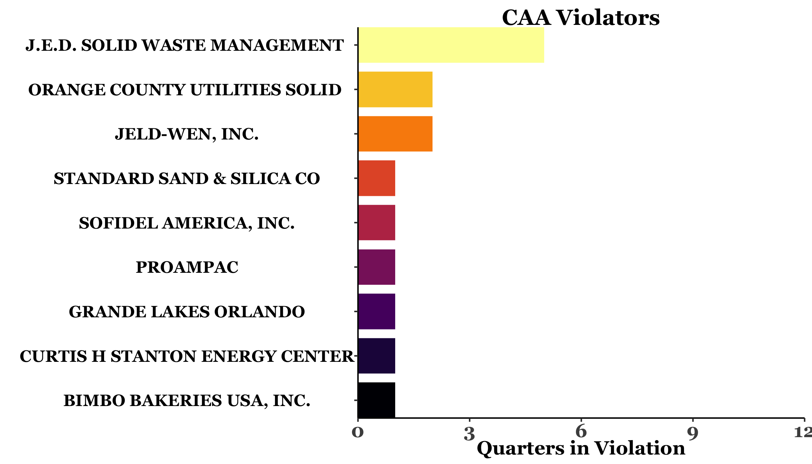

```{r setup, include=FALSE}
library(tidyverse)
library(palmerpenguins)
library(patchwork)
library(here)
library(ggplot2)
library(tidyr)
library(dplyr)
library(shiny)
library(extrafont)
library(viridis)
library(grid)
library(gridExtra)
library(fishualize)
library(kableExtra)
library(ggrepel)
library(stringr)
loadfonts()


knitr::opts_chunk$set(echo = FALSE, message = FALSE, warning = FALSE)
```

```{r readData, echo=FALSE}

#reading in all of the data and naming it based on the name of the .csv up to the first 2 underscores
#national data
filenames = list.files(here("nationalstats"), pattern = ".csv")
file_count = length(filenames)
for (i in filenames){  
  name <- gsub("^([^_]*_[^_]*)_.*$","\\1", i)
  assign(name, read.csv(here("nationalstats", i)))
}

names(USAinspectionsper1000_All)[1] <- "Program"
names(USAviolationsper1000_All)[1] <- "Program"
inflation <- inflation.csv
names(inflation)[2] <- "base"
housemembers <- housememberinfo.csv
CWAper1000 <- violationsper1000_CWA

#each time this section is run, change "here" to specify the subfolder for the district or state 
#Also, the way it is set up, you're going to need to cntrl f to change the district and date for the files
filenames = list.files(here("CD_Dirs/FL9"), pattern = ".csv")
file_count = length(filenames)
for (i in filenames){  
  name <- gsub("^([^_]*_[^_]*_[^_]*_[^-]*-[^-]*)-.*$","\\1", i)
  assign(name, read.csv(here("CD_Dirs/FL9", i)))
}

activefacilities <- `active-facilities_All_pg3_FL-9`

#set up a theme default to reduce code block later 
theme_meg <- function () { 
  theme_bw(base_family="Georgia") %+replace% 
    theme(panel.grid.major = element_blank(), panel.grid.minor = element_blank(),panel.border = element_blank(),
          axis.line = element_line(colour = "black"), axis.title.x=element_text(face = "bold", size = 12), 
          axis.title.y=element_text(face = "bold", size = 10, angle=90), plot.title=element_text(face = "bold", size = 14, hjust =.5), 
          axis.text.x=element_text(face = "bold", size = 14), axis.text.y=element_text(face = "bold", size = 8))
}

FL9 <- housemembers[which(housemembers$CD=="FL9"), ]

```

  <div class="title"><span style="padding-left: 150px">
 Congressional Report Card
 </span></div>
 <hr style="height:3px;border-width:0; margin-left:15px; margin-right:15px;color: #b9b9b9;background-color: #b9b9b9; margin-top: 0em; margin-bottom: 0em">
##### Florida's 9th District; seat held by `r FL9[1,2]` since `r FL9[1,8]` 
 <div class="container">
  
   <div class="bottom-left">Map shows congressional district or state with clusters of regulated facilities</div>
  </div>
<a href="https://www.environmentalenforcementwatch.org/"></a>
<a href="https://envirodatagov.org/"></a>

\pagebreak

<hr style="height:3px;border-width:0;color: #C1E0D7;background-color: #C1E0D7; margin-top: 2em">
<h4>Report Generated on 9.30.2020<span style="padding-left:400px">Page 5</span></h4> 

<h1><span style="margin-bottom:0px; padding-bottom:0px">Recent Non-Compliance in this District</span></h1>
<font size="2">These figures show the ten facilities in this district with the worst history of environmental compliance based on their number of noncompliant quarters in the past 3 years (not necessarily consecutive).</font>
```{r, fig.height = 7, fig.width = 5, fig.align = "left"}
#call in data and clean up 
CAAbadactors <- `noncomp_CAA_pg6_FL-9`
CAAbadactors <-CAAbadactors[!(CAAbadactors$noncomp_count==0),]
CAAbadactors <- CAAbadactors[-c(11:20),]
CAAbadactors$Facility <- CAAbadactors$FAC_NAME
CAAbadactors$Facility <- strtrim(CAAbadactors$Facility, 30)


#Let's try the CAA plot 

CAAfacilities <- CAAbadactors %>%
  mutate(Facility = fct_reorder(Facility, noncomp_count)) %>%
  ggplot( mapping=aes(x=Facility, y=noncomp_count, fill=Facility, group=1))+
  geom_bar(stat="identity", show.legend = FALSE, width=.8)+
  scale_fill_viridis(discrete = TRUE, option="B")+
  labs(y="Quarters in Violation", x="", title="CAA Violators")+
  scale_y_continuous(expand=c(0,0), limits=c(0,12))+
  scale_x_discrete(expand=c(0,0))+
  theme_meg()+
  theme(axis.text.y=element_text(size=12, face = "bold", color="black"), axis.title.x = element_text(size=14), axis.text.x=element_text(size=14,face = "bold"), plot.title=element_text(size=16))+
  coord_flip()


#call in data and clean up 
CWAbadactors <- `noncomp_CWA_pg6_FL-9`
CWAbadactors <-CWAbadactors[!(CWAbadactors$noncomp_count==0),]
CWAbadactors <- CWAbadactors[-c(11:20),]
CWAbadactors$Facility <- CWAbadactors$FAC_NAME
CWAbadactors$Facility <- strtrim(CWAbadactors$Facility, 30)


#Let's try the CWA plot 

CWAfacilities <- CWAbadactors %>%
  mutate(Facility = fct_reorder(Facility, noncomp_count)) %>%
  ggplot( mapping=aes(x=Facility, y=noncomp_count, fill=Facility, group=1))+
  geom_bar(stat="identity", show.legend = FALSE, width=.8)+
  scale_fill_viridis(discrete = TRUE, option="B")+
  labs(y="Quarters in Violation", x="", title="CWA Violators")+
  scale_y_continuous(expand=c(0,0),breaks=c(0,3,6,9,13), limits=c(0,13))+
  scale_x_discrete(expand=c(0,0))+
  theme_meg()+
  theme(axis.text.y=element_text(size=12, face = "bold", color="black"), axis.title.x = element_text(size=14), axis.text.x=
          element_text(size=14,face = "bold"), plot.title=element_text(size=16))+
  coord_flip()


#call in data and clean up 
RCRAbadactors <- `noncomp_RCRA_pg7_FL-9`
RCRAbadactors <-RCRAbadactors[!(RCRAbadactors$noncomp_count==0),]
RCRAbadactors <- RCRAbadactors[-c(11:20),]
RCRAbadactors$Facility <- RCRAbadactors$FAC_NAME
RCRAbadactors$Facility <- strtrim(RCRAbadactors$Facility, 30)


#Let's try the RCRA plot 

RCRAfacilities <- RCRAbadactors %>%
  mutate(Facility = fct_reorder(Facility, noncomp_count)) %>%
  ggplot( mapping=aes(x=Facility, y=noncomp_count, fill=Facility, group=1))+
  geom_bar(stat="identity", show.legend = FALSE, width=.8)+
  scale_fill_viridis(discrete = TRUE, option="B")+
  labs(y="Quarters in Violation", x="", title="RCRA Violators")+
  scale_y_continuous(expand=c(0,0), limits=c(0,12))+
  scale_x_discrete(expand=c(0,0))+
  theme_meg()+
  theme(axis.text.y=element_text(size=12, face = "bold", color="black"), axis.title.x = element_text(size=14), axis.text.x=
          element_text(size=14,face = "bold"), plot.title=element_text(size=16))+
  coord_flip()

#CAAfacilities / CWAfacilities / RCRAfacilities 

ggsave("CAAfacilities.png", CAAfacilities, path=here("CD_Dirs/FL9"), scale = 3, width=7, height=4, units=c("cm"))
ggsave("CWAfacilities.png", CWAfacilities, path=here("CD_Dirs/FL9"), scale = 3, width=7, height=4, units=c("cm"))
ggsave("RCRAfacilities.png", RCRAfacilities, path=here("CD_Dirs/FL9"), scale = 3, width=7, height=4, units=c("cm"))

```
<a ></a>

<font size="3">**ECHO reports for facilities:**</font>

<font size="2">[`r CAAbadactors[1,8] `](`r CAAbadactors[1,5] `)</font>
<br />
<font size="2">[`r CAAbadactors[2,8] `](`r CAAbadactors[2,5] `)</font>
<br />
<font size="2">[`r CAAbadactors[3,8] `](`r CAAbadactors[3,5] `)</font>
<br />
<font size="2">[`r CAAbadactors[4,8] `](`r CAAbadactors[4,5] `)</font>
<br />
<font size="2">[`r CAAbadactors[5,8] `](`r CAAbadactors[5,5] `)</font>
<br />
<font size="2">[`r CAAbadactors[6,8] `](`r CAAbadactors[6,5] `)</font>
<br />
<font size="2">[`r CAAbadactors[7,8] `](`r CAAbadactors[7,5] `)</font>
<br />
<font size="2">[`r CAAbadactors[8,8] `](`r CAAbadactors[8,5] `)</font>
<br />
<font size="2">[`r CAAbadactors[9,8] `](`r CAAbadactors[9,5] `)</font>
<br />
<font size="2">[`r  na.omit(CAAbadactors[10,8]) `](`r na.omit(CAAbadactors[10,5]) `)</font>

<br />

<a ></a>

<font size="3">**ECHO reports for facilities:**</font>

* <font size="2">[`r CWAbadactors[1,8] `](`r CWAbadactors[1,5] `)</font>
* <font size="2">[`r CWAbadactors[2,8] `](`r CWAbadactors[2,5] `)</font>
* <font size="2">[`r CWAbadactors[3,8] `](`r CWAbadactors[3,5] `)</font>
* <font size="2">[`r CWAbadactors[4,8] `](`r CWAbadactors[4,5] `)</font>
* <font size="2">[`r CWAbadactors[5,8] `](`r CWAbadactors[5,5] `)</font>
* <font size="2">[`r CWAbadactors[6,8] `](`r CWAbadactors[6,5] `)</font>
* <font size="2">[`r CWAbadactors[7,8] `](`r CWAbadactors[7,5] `)</font>
* <font size="2">[`r CWAbadactors[8,8] `](`r CWAbadactors[8,5] `)</font>
* <font size="2">[`r CWAbadactors[9,8] `](`r CWAbadactors[9,5] `)</font>
* <font size="2">[`r CWAbadactors[10,8] `](`r CWAbadactors[10,5] `)</font>

<a ></a>

<font size="3">**ECHO reports for facilities:**</font>

* <font size="2">[`r RCRAbadactors[1,8] `](`r RCRAbadactors[1,5] `)</font>
* <font size="2">[`r RCRAbadactors[2,8] `](`r RCRAbadactors[2,5] `)</font>
* <font size="2">[`r RCRAbadactors[3,8] `](`r RCRAbadactors[3,5] `)</font>
* <font size="2">[`r RCRAbadactors[4,8] `](`r RCRAbadactors[4,5] `)</font>
* <font size="2">[`r RCRAbadactors[5,8] `](`r RCRAbadactors[5,5] `)</font>
* <font size="2">[`r RCRAbadactors[6,8] `](`r RCRAbadactors[6,5] `)</font>
* <font size="2">[`r RCRAbadactors[7,8] `](`r RCRAbadactors[7,5] `)</font>
* <font size="2">[`r RCRAbadactors[8,8] `](`r RCRAbadactors[8,5] `)</font>
* <font size="2">[`r RCRAbadactors[9,8] `](`r RCRAbadactors[9,5] `)</font>
* <font size="2">[`r RCRAbadactors[10,8] `](`r RCRAbadactors[10,5] `)</font>

\pagebreak

